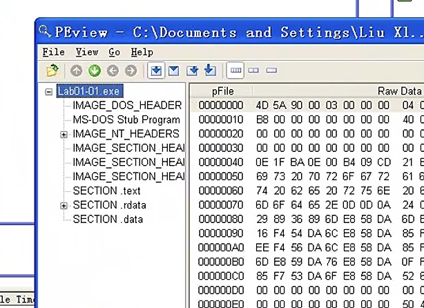
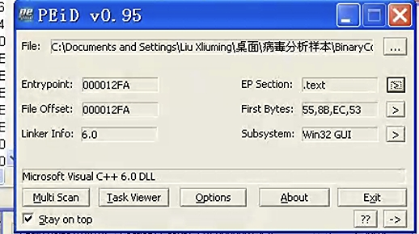

# <center>**恶意代码分析与防治技术实验报告**</center>

## <center>**Lab1**</center>

## <center> **网络空间安全学院 信息安全专业**</center>

## <center> **2112492 刘修铭 1063**</center>

# 一、实验目的

1. 借助病毒分析工具，了解分析给定的病毒分析样本，对恶意代码有一个初步认识；
2. 掌握Yara的使用方法，能够编写简单的匹配规则。


# 二、实验原理

## （一）Yara

YARA 是一种用于检测恶意软件和威胁情报的开源工具。它是一个用于规则匹配的强大引擎，允许安全专业人员创建自定义规则来识别恶意文件、活动或代码。

## （二）实验环境

为了保护本机免受恶意代码攻击，本次实验主体在虚拟机上完成，以下为相关环境：

1. 已关闭病毒防护的Windows11
2. 在VMware上部署的Windows XP虚拟机

## （三）实验工具

1. 待分析病毒样本（解压缩于XP虚拟机）


2. 相关病毒分析工具，如PETools、PEiD、Strings、Yara等


# 三、实验过程

## （一）Lab 1-1

1. **将Lab01-01.exe文件上传至[VIRUSTOTAL](https://www.virustotal.com/)进行分析并查看其反馈报告。文件匹配到了已有的反病毒软件特征吗？**
   * 将Lab01-01.exe文件上传后，可以观察到如下图所示的反馈信息，可以清晰的看到，该文件中被匹配到55个反病毒引擎。


2. **这些文件都是什么时候编译的？**
   * 为了查看其编译时间，我们选用PETools工具对Lab01-01.exe和Lab01-01.dll文件进行查看分析。借助这个工具，我们可以看到两份文件的编译时间均为2010-12-19，而且前后相隔时间较短，仅为19秒。
     * 如此接近的编译时间，我们分析可能是同一作者在同一时间创建了这些文件，由于DLL动态链接库文件无法自己运行，故而这个.exe 极有可能是用来是使用或安装.dll 文件的。


3. **这两个文件中是否存在迹象说明它们是否被加壳或混淆了？如果是，这些迹象在哪里？**
   * 将Lab01-01.exe 文件导入PEiD工具后得到如下图所示的信息，我们可以看到，并没有出现加壳信息，而且可以观察到该文件由Microsoft Visual C++ 6.0编译，并且文件中的分节显示，虚拟大小并没有出现比原始数据大很多的情况。
   
     
   
     
   
   * 将Lab01-01.exe 导入 PEView后得到如下图所示信息，观察到PE头部中有着适当大小良好组织的文件节，只有少量导出程序，说明它们可能只是一些小程序。
   
     
   
   * 同理，对Lab01-01.dll进行同样的操作分析，如下图所示，可以发现，该文件也没有被加壳或者混淆的情况。





4. **是否有导入函数显示这个恶意代码的用途？如果是，有哪些导入函数。**

   * 在VMware虚拟机Windows XP环境下使用Dependency Walker工具打开 Lab01-01.exe，发现KERNEL32.DLL和MSVCRT.DLL两个动态链接库。

     * 从MSVCRT.DLL导入的函数通常是被每一个可执行文件都包含，因为它们是作为包装代码被编译器加入可执行文件的。查看从KERNEL32.DLL导入的函数时，可以看到一些打开与操作文件的函数以及FindFirstFile、FindNextFile 和 CopyFile等，这些函数意味着，恶意代码可以对文件进行搜索、打开、复制和修改等操作，同时.exe字符串说明，恶意代码正在寻找搜索目标系统上的可执行文件。

       

   * 在VMware虚拟机Windows XP环境下使用Dependency Walker工具打开 Lab01-01.dll，显示了导入DLL列表，发现KERNEL32.DLL和WS2_32.DLL两个动态链接库。

     * 通过查询可知，WS2\_32.dll 提供了联网功能，打开WS2_32.DLL发现这些导入函数都是按照序号进行导入的。打开KERNEL32.DLL可以看到CreateProcess 和 Sleep两个函数，而这两个函数普遍使用在后门程序中。

       

       

5. **是否有任何其他文件或者基于主机的迹象，让你可以在受感染系统上查找？**

   * 借助Srings工具检查Lab01-01.exe文件时，我们可以同时观察到 C:\Windows\System32\kernel32.dll 和 C:\Windows\System32\kerne132.dll。

     * 文件kerne132.dll，用数字1代替了字母1，猜测是为了模仿系统文件kernel32.dll的恶意文件，因此这个文件可以用来在主机作为恶意代码感染的迹象进行搜索。

     

   * 借助Srings工具检查Lab01-01.dll 文件的字符串时，除了已知的 CreateProcessA 和 Sleep，我们还注意到 exec 和 sleep。

     * 经过查询可知，exec 可能用于通过网络给后门程序传送命令 ，再利用 CreateProcess 函数运行某个程序 。而sleep 可能用于让后门程序进入休眠模式。

     

6. **是否有基于网络的迹象可以用来发现感染机器上的恶意代码？**

   * 借助Srings工具检查Lab01-01.dll 文件时发现其中包含一个私有子网IP地址 127.26.152.13的字符串。
     * 结合其调用的 WS2\_32.dll，猜测该程序可能联网通信。此次的IP地址为 127 开头的 IP 为本地地址，在此处表明是用于教学目的，而在现实中却可能指向一个具体的外网 IP。这是一个很好的基于网络的恶意代码感染迹象，可以用来识别这个恶意代码。

7. **你猜这些文件的目的是什么？**
   * .dll 文件可能是一个后门文件，而.exe文件则是用来安装与运行dll文件。

## （二）Lab1-2

1. **将Lab01-02.exe文件上传至[VIRUSTOTAL](https://www.virustotal.com/)进行分析并查看其反馈报告。文件匹配到了已有的反病毒软件特征吗？**

   * 将Lab01-02.exe文件上传后，可以观察到如下图所示的反馈信息，可以清晰的看到，该文件中被匹配到56个反病毒引擎。

     

2. **是否有这个文件被加壳或混淆的任何迹象？如果是这样，这些迹象是什么？如果文件被加壳，请进行脱壳，如果可能的话。**

   * 使用PEiD打开Lab01-02.exe，显示`Nothing found *` ，在 PEiD 的 Options 里选择 Deep Scan，可以看到是 UPX 加的壳。其次可以观察到UPX0段，虚拟大小为0x4000，而原始数据大小却为0，UPX0是长度最大的节，标记为可执行，因此其中可能包含了原始的未加壳代码。

     

     

   * 使用PEview打开Lab01-02.exe查看节区，出现UPX字段，明显是由UPX进行加壳后恶意代码程序的节名称。

     

   * 综上所述，可以推断是UPX加壳。下面通过UPX工具，执行 `upx -o Lab01-02-new.exe -d Lab01-02.exe` 指令对Lab01-02.exe进行脱壳。

     

   * 脱壳后再次通过PEiD和PEview，通过一下Microsoft Visual C++ 6.0编译等信息，可以看出来此时没有加壳或者混淆的痕迹了，说明脱壳成功。

     


3. **有没有任何导入函数能够暗示出这个程序的功能？如果是，是哪些导入函数，他们会告诉你什么？**

   * 脱壳之后，在虚拟机Windows XP系统下使用Dependency Walker软件打开 Lab01-02-new.exe，KERNEL32.DLL和MSVCRT.DLL两个动态链接库中的函数通常是被每一个可执行文件都包含，所以它们能告诉我们关于这个恶意代码的信息很少。从**WININET.DLL**导入的函数**InternetOpen和InternetOpenURL**表示这个恶意代码会进行**联网**操作。从**ADVAPI32.DLL**导入的函数**CreateService**表示这个代码会**创建一个服务**。

     

4. **哪些基于主机或基于网络的迹象，可以被用来确定这个恶意代码所感染的机器？**

   * 通过Strings工具检查字符串列表，发现`http://www.malwareanalysisbook.com`，推测可能是InternetOpenURL函数中所打开的URL。除此之外，还发现Malservice字符串，所以应该通过一个名为Malservice的服务，并通过`http://www.malwareanalysisbook.com`的网络流量，来检查恶意代码感染的主机。

     

## （三）Lab1-3

1. **将Lab01-03.exe文件上传至[VIRUSTOTAL](https://www.virustotal.com/)进行分析并查看其反馈报告。文件匹配到了已有的反病毒软件特征吗？**

   * 将Lab01-03.exe文件上传后，可以观察到如下图所示的反馈信息，可以清晰的看到，该文件中被匹配到61个反病毒引擎。

     

2. **是否有这个文件被加壳或混淆的任何迹象？如果是这样，这些迹象是什么？如果文件被加壳，请进行脱壳，如果可能的话。**

   * 使用PEiD打开Lab01-03.exe观察到，其将加壳器标识为FSG 1.0-> dulek/xt ，并且注意到首节虚拟大小为0x3000，而原始数据大小却为0，这意味着Windows将会为.text分配内存空间，加壳器将会脱出可执行代码到一个分配的.text节中。

     

     

   * 使用PEview打开Lab01-03.exe，可以发现文件的节没有名字。

     

   * 由上述特征可以判断这个文件是加壳的，未脱壳前，只能在 kernel32.dll 中看到 LoadLibrary 和 GetProcAddress 导入函数。经过寻找万能脱壳软件、自学部分手动脱壳知识等还未能成功进行脱壳。因此后两问目前无法回答。


## （四）Lab1-4

1. **将Lab01-04.exe文件上传至[VIRUSTOTAL](https://www.virustotal.com/)进行分析并查看其反馈报告。文件匹配到了已有的反病毒软件特征吗？**

   * 将Lab01-04.exe文件上传后，可以观察到如下图所示的反馈信息，可以清晰的看到，该文件中被匹配到59个反病毒引擎。

     

2. **是否有这个文件被加壳或混淆的任何迹象？如果是这样，这些迹象是什么？如果文件被加壳，请进行脱壳，如果可能的话。**

   * 将 Lab01-04.exe 导入到PEview和PEiD软件中，发现PE头部分组织良好并且没有提示加壳信息，虚拟大小和原始数据大小基本一致，因此没有迹象显示这个文件是加壳或混淆的。

     

     


3. **这个文件是什么时候编译的？**

   * 为了查看其编译时间，我们选用PETools工具对Lab01-04.exe文件进行查看分析。借助这个工具，我们可以看到文件的编译时间为2019-8-30，但同其创建时间相比，不由得让人怀疑该编译时间为伪造，但目前我的能力还无法确定该推断。

     

4. **有没有任何导入函数能够暗示出这个程序的功能？如果是，是哪些导入函数，他们会告诉你什么？**
   * 从ADVAPI32.DLL导入的函数，表示程序做了一些与权限有关的事情，试图访问使用了特殊权限进行保护的文件。
   * 从KERNEL32.DLL的导入函数告诉我们这个程序从资源节中装载数据（LoadResource、FindResource和SizeofResource），并写一个文件到磁盘上（CreateFile和WritFile），接着执行一个磁盘上的文件（WinExec）。因为它调用了GetWindowDirectory函数，可以猜测这个程序将文件写入到了系统目录。


5. **哪些基于主机或基于网络的迹象，可以被用来确定这个恶意代码所感染的机器？**
   + 使用Strings工具检查字符串，出现`\system32\wupdmgrd.exe` （Windows 升级管理器），结合GetWindowDirectory函数调用，表明恶意代码在`C：Windows\system32\wupdmgrd.exe` 位置创建或修改一个文件。
   + 而`www.malwareanalysisbook.com/updater.exe` 很可能是要下载的恶意代码的存储位置，或者是伪装成这个文件。URLDownloadToFile 则间接印证了下载器的功能。


6. **这个文件在资源段中包含一个资源，使用Resource Hacker工具来检查资源，然后抽取资源，资源中你能发现什么吗？**

   * 可以看到资源段中还有一个可执行文件（101:1033） ，观察到字符串！This program cannot be run in DOS mode，这个字符串是在所有PE文件处的DOS头部中都会包含错误消息，因为推断这一资源其实是在Lab01-04.exe资源节中存储的另一个可执行文件。

     

   * 右键 101:1033，选择 Save Resource to a BIN filee保存，查看导入表，可以看到嵌入文件在访问一下网络函数，它调用了URLDownloadToFile，一个由恶意下载器普遍使用的函数，它调用了WinExec函数，可能执行了下载到的文件。

     

     

## （五）yara分析

通过上文对实验分析样本的分析，我们可以发现，上述文件均适配filesize<10MB and uint16(0)==0x5A4D and 

uint16(uint16(0x3C))==0x00004550的匹配规则，故将其作为一个“全局规则”进行使用，下面不再赘述。

### 1. Lab 1-1

* Lab01-01.exe
  * 通过上述分析将kerne132.dll、FindFirstFile、FindNextFile 和 CopyFile等作为匹配规则。

```yara
rule lab11exe
{
strings:
	$string1 = "Lab01-01.dll"
	$string2 = "kerne132.dll"
	$string3 = "C:\\windows\\system32\\kerne132.dll"
	$string4 = "FindFirstFile"
	$string5 = "FindNextFile"
	$string6 = "CopyFile"
condition:
	filesize < 10MB and uint16(0) == 0x5A4D and uint16(uint16(0x3C)) == 0x00004550 and $string1 and $string2 and $string3 and $string4 and $string5 and $string6
}
```

* Lab01-01.dll
  * 上文提到，借助其他工具对Lab01-01.dll进行检查时，我们发现其调用了WS2\_32.dll ，该文件提供了联网功能；打开KERNEL32.DLL可以看到CreateProcess 和 Sleep两个函数，而这两个函数普遍使用在后门程序中。因为我们可以将其视为匹配检测的特征

```yara
rule lab11dll
{
strings:
	$string1 = "sleep"
	$string2 = "exec" 
	$string3 = "CreateProcessA"
condition:
	filesize < 10MB and uint16(0) == 0x5A4D and uint16(uint16(0x3C)) == 0x00004550 and $string1 and $string2 and $string3
}
```

### 2. Lab1-2

* Lab01-02.exe
  * 上文提到，我们对脱壳后程序进行分析时，发现其中含有许多可疑字符串，包括http://www.malwareanalysisbook.com、MalService、HGL345等，我们将其视为匹配检测的特征。
  * 直接利用Yara对其进行分析可以发现，无法发现寻找到以上字符串，于是利用IDA进行静态分析，可以发现一些残缺的混有其他字符的字符串。

```yara
rule lab12exe
{
strings:
	$string1 = "HGL345"
	$string2 = "MalService" 
	$location = {68 74 74 70 3A 2F 2F 77 FF B7 BF DD 00 2E 6D 1E 77 61 72 65 61 6E 07 79 73 69 73 62 6F 6F 6B 2E 63 6F FF DB DB 6F 6D}
condition:
	filesize < 10MB and uint16(0) == 0x5A4D and uint16(uint16(0x3C)) == 0x00004550 and $string1 and $string2 and $location
}
```

### 3. Lab1-3

* Lab01-03.exe
  * 由于未能成功脱壳，故只能对脱壳前程序中可疑字符串进行分析检测。

```yara
rule lab13exe
{
strings:
	$string1 = "ole32.vd"
	$string2 = "OLEAUTLA" 
	$string3 = "_getmas"
condition:
	filesize < 10MB and uint16(0) == 0x5A4D and uint16(uint16(0x3C)) == 0x00004550 and $string1 and $string2 and $string3
}
```

### 4. Lab1-4

* Lab01-04.exe
  * 通过上述分析，我们发现其中含有诸如LoadResource、FindResource和SizeofResource等的函数，以及一些可疑字符串，将其作为检测规则。

```yara
rule lab14exe
{
strings:
	$string1 = "LoadResource"
	$string2 = "FindResource" 
	$string3 = "SizeofResource"
	$string4 = "\\system32\\wupdmgr.exe"
	$string5 = "http://www.practicalmalwareanalysis.com/updater.exe"
condition:
	filesize < 10MB and uint16(0) == 0x5A4D and uint16(uint16(0x3C)) == 0x00004550 and $string1 and $string2 and $string3 and $string4 and $string5
}
```

### 5. 运行结果

可以看到，五个文件均被检出。


### 6. 测试

编写python代码对整个病毒样本文件夹进行遍历，匹配病毒文件。

```python
import os
import time
import yara
# 创建YARA规则对象并加载规则文件
rules = yara.compile('./yara/lab1.yar')

# 要扫描的目标文件夹路径
target_folder = './yara'

# 获取程序开始时间
start_time = time.time()

# 遍历目标文件夹
for root, dirs, files in os.walk(target_folder):
    for filename in files:
        file_path = os.path.join(root, filename)

        try:
            # 打开文件并读取内容
            with open(file_path, 'rb') as f:
                data = f.read()

            # 使用YARA规则进行匹配
            matches = rules.match(data=data)

            # 如果有匹配，处理匹配结果
            if matches:
                print(f"文件 {file_path} 匹配的规则: {matches}")

        except Exception as e:
            print(f"处理文件 {file_path} 时出错: {str(e)}")

# 获取程序结束时间
end_time = time.time()

# 计算并输出程序运行时间
elapsed_time = end_time - start_time
print(f"程序运行时间: {elapsed_time} 秒")
# 创建YARA规则对象并加载规则文件
rules = yara.compile('./yara/lab1.yar')

# 要扫描的目标文件夹路径
target_folder = './yara'

# 获取程序开始时间
start_time = time.time()

# 遍历目标文件夹
for root, dirs, files in os.walk(target_folder):
    for filename in files:
        file_path = os.path.join(root, filename)

        try:
            # 打开文件并读取内容
            with open(file_path, 'rb') as f:
                data = f.read()

            # 使用YARA规则进行匹配
            matches = rules.match(data=data)

            # 如果有匹配，处理匹配结果
            if matches:
                print(f"文件 {file_path} 匹配的规则: {matches}")

        except Exception as e:
            print(f"处理文件 {file_path} 时出错: {str(e)}")

# 获取程序结束时间
end_time = time.time()

# 计算并输出程序运行时间
elapsed_time = end_time - start_time
print(f"程序运行时间: {elapsed_time} 秒")
```

运行结果如下


### 7. 优化Yara

1. 减少对文件的全局搜索，利用如IDA等静态分析工具精准定位诸如字符串等的特征位置，加速检索；
2. 使用通配符或正则表达式比简单的字符串匹配性能低；
3. 分批处理大规模文件；
4. 利用好诸如文件大小等的限定条件，加速检索性能。


# 四、实验结论及心得

1. 对于一些特定的功能性函数有了了解，通过导入函数判断相应恶意代码功能。
2. 对于如何判断加壳方式有了全面的了解，不仅局限在使用PEiD查看加壳器的提示，而是学会根据.text等节的虚拟大小和原始数据大小对比等判断是否存在加壳问题。
3. 初步掌握利用Yara进行病毒文件的检索功能。
