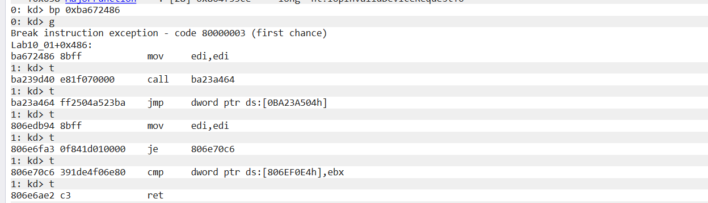
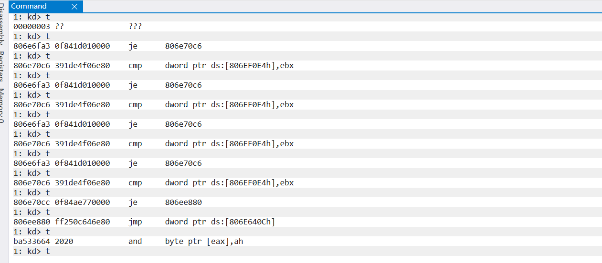
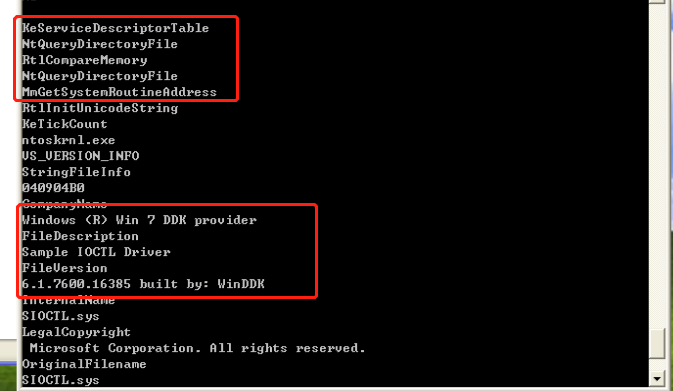

# <center>**恶意代码分析与防治技术实验报告**</center>

## <center>Lab10</center>

## <center> **网络空间安全学院 信息安全专业**</center>

## <center> **2112492 刘修铭 1063**</center>

https://github.com/lxmliu2002/Malware_Analysis_and_Prevention_Techniques

# 一、实验目的

1. 了解 WinDbg 内核调试；
1. 进一步熟悉静态分析与动态分析的过程。


# 二、实验环境

为了保护本机免受恶意代码攻击，本次实验主体在虚拟机上完成，以下为相关环境：

1. 已关闭病毒防护的 Windows11
2. 在 VMware 上部署的 Windows XP 虚拟机
   * 在进行动态分析时，需对虚拟机做如下处理：
     * 对 VMware 进行快照，便于恢复到运行前的状态
     * 启动 ApateDNS，将 DNS Reply IP 设置为 127.0.0.1
     * 启动 Process Monitor，并按照实验要求设置过滤条件
     * 启动 Process Explorer
     * 启动 netcat：nc-l -p XXX
     * 启动 wireShark 抓取数据包


# 三、实验工具

1. 待分析病毒样本（解压缩于 XP 虚拟机）

2. 相关病毒分析工具，如 PETools、PEiD、Strings 等
3. WinDbg 内核调试工具
4. Yara检测引擎


# 四、实验过程

## （一）Lab 10-1

### 1. 程序分析

使用 Dependency Walker 对 Lab10-01.exe 进行导入函数静态分析，可以观察到下面的导入函数，表明这个程序创建了一个服务，并且可能启动或者操作了这个服务，除此之外，他与系统进行了很少的交互。


接着使用 Strings 对 Lab10-01.exe 进行字符串分析，从字符串里可以看到这个程序会启动一个服务，并且注册一个服务；同时，也有一个指定文件 C:\Windows\System32\Lab10-01.sys，这暗示 Lab10-01.sys 可能包含这个服务的代码。


使用 Dependency Walker 对 Lab10-01.sys 进行导入函数静态分析，可以观察到 RtlCreateRegistryKey 和 RtlWriteRegistryValue，说明该驱动可能访问了注册表。


接着使用 Strings 查看其字符串。这些字符串包含了一些注册表键值，但不是诸如 HKLM 此类的常见注册表根键。当从内核态访问注册表时，前缀 \Registry\Machine 等同于用户态程序访问的 HKEY_LOCAL_MACHINE。其中的 EnableFirewall 就是关闭了 windows 的防火墙。


使用 IDA 进一步分析，发现 Lab10-01.exe 首先调用了 OpenSCManagerA 函数以获取当前服务管理器的句柄，然后调用 CreateServiceA 函数创建一个名为 Lab10-01 的服务，且服务使用了 C:\Windows\System32\Lab10-01.sys 中代码，并且 dwStartType 设置为3，即该服务会以内核级运行。


如果调用成功，则跳转到 401069，如果失败则调用 OpenServiceA，代表这个服务在宿主机中已经存在而，不用反复感染，只需要直接返回句柄操作即可。


接着调用 StartServiceA 函数启动服务，最后调用 ContorlService 函数，传入的第二个参数是1，判断该函数会调用驱动的卸载函数来卸载驱动。


下面使用 IDA 分析 Lab10-01.sys。查看 DriverEntry 函数，当打开驱动文件，移到其入口点时，在 00010964 位置无条件跳转到 sub_10906，即这个驱动程序真正的入口点应该是在这个函数的位置。下面进一步步入检查。


进入检查，看到其只是把一个偏移地址载入内存。


查看 procmon，可以看到其确有打开、查询注册表的行为，但是没有明显的更改操作。


接着使用 WinDbg 进行内核调试。为了便于分析，在虚拟机中将执行程序载入到 Windbg 中，并在驱动加载以及卸载之间打上断点，在然后启动程序直到断点命中。此时，sys 驱动文件已经成功载入内存。


下面返回宿主机对其进行内核调试。通过 !drvobj Lab10-01 查看其创建的服务。在这里设备列表为空，这个驱动没有供应用程序访问的设备。


上面得知，驱动对象以及其地址为 8a02a460，使用 dt 命令查看驱动对象，找到其卸载驱动时调用的函数的地址为 0xba672486。


接着，在宿主机设置断点，并且恢复执行，在虚拟机中使用 g 命令恢复执行，程序执行到断点，此时虚拟机会出现卡死的情况，之后返回到宿主机，可以看到汇编代码，使用单步调试以分析后续的指令。


可以观察到程序调用了三次 CreateRegistryKey 函数，创建了注册表键然后两次调用 WriteRegistryValue 在两个地方将防火墙的值设置为0。





借助 IDA 进一步分析。在 WinDbg 中使用 lm 指令可以看到文件被加载到 0xba672000，卸载函数被加载到 0xba672486，0xba672486 减去 0xba672000 得到偏移量 0x486，基址为 0x00100000，则在 0x00100486 地址处可以看到卸载函数。


使用 IDA 加载文件，可以在上述位置看到函数。


### 2. 问题解答

#### （1）这个程序是否直接修改了注册表？（使用 procmon 来检查）

对 procmon 中捕获的数据进行过滤，查看 RegSetValue，可以观察到唯一写注册表的调用是通过写键值 HKLM\SOFTWARE\Microsoft\Cryptography\RNG\Seed 的 RegSetValue 调用，对注册表的一些间接修改通过调用 CreateServiceA 来完成。


但根据前面分析，这个程序从内核对注册表进行了直接修改，但却不能被 procmon 捕获到。

#### （2）用户态的程序调用了 ControlService 函数，你是否能使用 WinDbg 设置一个断点，以此来观察由于 ControlService 的调用导致内核执行了怎样的操作。

结合 IDA 分析，找到函数入口地址，借助 bp 指令即可设置断点。重启可执行文件之后，断点将会被触发。

#### （3）这个程序做了什么？

这个程序创建一个服务来加载驱动，然和驱动代码会创建注册表键 \Registry\Machine\SOFTWARE\Policies\Microsoft\WindowsFirewall\StandardProfile 和\Registry\Machine\SOFTWARE\Policies\Microsoft\WindowsFirewall\Domain Profile。在 Windows XP 系统中，设置这些键将禁用防火墙。

## （二）Lab 10-2

### 1. 程序分析

使用 Dependency Walker 查看 Lab10-02.exe 的导入表，可以看到，其调用了 CloseServiceHandle、CreateServiceA、OpenSCMangerA 以及 StartServiceA，表示这个程序会创建并启动一个服务；此外，还调用了 CreatFile 和 WriteFile，表明这个程序将创建并写文件；另外还看到了 LoadResource 和 SizeOfResource 调用，表示这个程序会对 Lab10-02.exe 的资源节进行操作。


使用 Resource Hacker 来检查资源节，发现其中包含了另外一个 PE 头部，推测是 Lab10-02.exe 将要使用的另外一个恶意代码文件。


查看 procmon，可以发现其在 C:\Windows\System32 目录下创建了一个文件，并且以这个文件作为一个可执行程序创建了服务。


使用 Strings 工具对可执行文件进行扫描，发现其是一个内核文件。



下面使用 IDA 进一步分析。首先查看 NtQueryDirectoryFile 函数。


步入检查，可以看到一个跳转语句，语句的函数名与其相同，说明其意图伪装。


接着就是关于 ReturnSingleEntry 字段了，如果该参数为真，NtQueryDirectoryFile 只返回找到的第一个条目。


NtQueryDirectoryFile 函数返回 STATUS_SUCCESS 或是错误状态；返回 IoStatusBlock 的 Information 成员中实际写入给定 FileInformation 缓冲区的字节数。其实返回的是 FileInforMation 结构，而该结构在 FileInformationClass 字段中定义，经查询，得知其由一系列的 FILE_BOTH_DIR_INFORMATION 结构组成，这个结构的第一个域指向下一个 FILE_BOTH_DIR_INFORMATION 结构的偏移量，只要我们能够修改第一个结构的域的指针指向的位置，使其指向第三个结构那么我们就不能看到第二个结构了。

继续观察，可以看到一个循环，其调用了 RtlCompareMemory 函数。


于是可以找到 FileInformation 字段，是一个 FILE_BOTH_DIR_INFORMATION 的结构体，得到 FileName 字段；而 word_1051A 字段，是内存没定义值，利用交叉引用也没有找到赋值语句，因而推测其是一个运行时的值。

继续运行，假定正确返回，继续运行。


将前面引用到的另一个恶意代码文件提取，继续分析。将其反汇编得到伪代码。其首先找到 SSDT 地址和 NtQueryDirectoryFile 地址，接着遍历 SSDT 找到 NtQueryDirectoryFile 项，然后遍历 SSDT 找到 NtQueryDirectoryFile 项，而 NtQueryDirectoryFile 则循环将文件名与 Mlxw 比较，如果匹配就修改上一个的 NextEntryOffset 跳过匹配文件，保证了每个以 Mlwx 开头的文件会被跳过，并且从目录列表中隐藏。


### 2. 问题解答

#### （1）这个程序创建文件了吗？它创建了什么文件？

创建了 C:\Windows\System32\Mlwx486.sys。

#### （2）这个程序有内核组件吗？

有，被存储在 Lab10-02.exe 的资源节中，然后写入硬盘并作为一个服务加载到内核。

#### （3）这个程序做了些什么？

这个程序被设计来隐藏文件，它使用 SSDT 挂钩来覆盖 NtQueryDirectoryFile 的入口，隐藏目录列表中任何以 Mlwx 开头的文件。

## （三）Lab 10-3

### 1. 程序分析

使用 Strings 查看文件字符串，可以看到其有与写文件相关的字段，而且可以看到，其中有与显示一个广告页面相关的信息。


使用 Dependency Walker 查看 Lab10-02.exe 的导入表，其中 IoGetCurrentProcess 导入函数表明这个驱动或者修改正在运行进程或者需要关于进程的信息。


将 sys 驱动文件复制到 C:\Windows\System32，双击可执行程序运行，可以看到一个弹出广告，并且大约30s后再次弹出广告，不断循环。打开任务管理器试图终止运行进程时，看到没有程序正在运行，且 Process ExPlorer 也没有捕获到相关信息。

下面使用 IDA 进行进一步分析。在主函数中分析其调用的函数，WinMain 函数的功能大体上可以分为两部分，第一部分是 OpenSCManager、CreateService、StartService、CloseServiceHandle、CreateFile、DeviceIoControl 函数，包括创建启动服务，发送请求到内核；而第二部分由其余部分组成，由 OleInitialize 函数可知这是一个COM对象的调用。


首先分析 CreateService 函数。可以看到程序创建了一个 Process Helper 的服务，负责加载驱动 Lab10-03.sys 然后启动该服务加载 sys 文件到内核并打开句柄 .\\\\ProcHelper。


接着分析DeviceIoControl函数。因为作为参数传递给它的输入和输出参数，将会被发送到内核代码，因此需要单独分析，注意到其参数 lpOutBuffer 和 lpInBuffer 被设置为NULL，这意味着这个请求没有发送任何信息到内核驱动，并且内核驱动也没有反馈任何信息，还注意到，值为 0xABCDEF01 的 dwIoControlCode 被传递给内核驱动。


继续分析，可以看到其访问网站并且在两次调用之间调用 Sleep 函数，休眠 30 秒。


接着使用 IDA 分析内核文件，可以看到其调用了 IoCreateDevice 函数，创建了一个 \\\\Device\\\\ProHelper 的设备。


随后函数调用 IoCreateSymbolicLink 时，创建一个名为 \DosDevices\ProcHelper 的符号链接供用户态应用程序访问。


接着使用 WinDbg 进行内核调试。使用 !devobj ProcHelper 指令找到其设备对象。


DriverObject 包含所有函数的指针，当用户空间的程序访问设备对象时调用这些函数，DriverObject 存储在一个叫做 DRIVER_OBJECT 的数据结构中，使用 dt 命令查看标注的驱动对象：这段代码包含了函数指针，可以看到 DriverInit、DriverEntry、DriverUnload 在实验一中被重点分析，当驱动卸载时被调用，可以在 IDA 中看到它删除了符号链表和 DriverEntry 创建的设备。


接下来可以分析主函数表。通过 dd 命令查看主函数中表项，表中的每一项表示不同类型的请求，其中大部分都是 804f55ce，这个项表示驱动不能处理的一个请求类型。


根据他的表项查找到对应的函数，使用 x /D 命令，并选择以 I 开头的内容可以看到对应地址的内容为 IopInvalidDeviceRequest，这意味其处理驱动无法处理的非法请求。


返回 IDA 查看这个函数，可以看到 DeviceIoControl 操作了当前进程的 PEB，这个函数做的第一件事就是调用函数 IoGetCurrentProcess，而这个函数会返回 DeviceIoControl 的 EPROCESS 结构，然后这个函数在接下来访问偏移量为 0x88 处的数据，再然后访问偏移量为 0x8c 处的下一个 DWORD。


使用 dt 命令发现存储在 PEB 结构偏移量 0x88 和 0x8c 的 LIST_ENTRY。


LIST_ENTRY 就是一个包含 prev 和 next 的双向链表，sys 呈现首先获取列表中指向下一个结构的指针，然后获取列表中指向前一个的指针，再覆盖下一项的 prev 指针使其指向前一项，在此之前，下一项的 prev 指针指向覆盖项，也就是说，整个链表结构跳过了中间的LIST_ENTRY 结构。在操作系统正常运行时，每个进程都有一个指针指向它前一个进程和后一个进程的指针。本次实验样本通过修改 LIST_ENTRY 使其跳过 Lab10-03 进程让我们不能通过控制面板或者 process explorer 查看到该进程。

### 2. 问题解答

#### （1）这个程序做了什么？

用户态程序加载驱动，然后每隔 30s 就弹出一个广告，这个驱动通过从系统链表中摘除进程环境块（PEB），来隐藏进程 。

#### （2）一旦程序运行，该怎么停止他？

重启电脑。

#### （3）他的内核组件做了什么？

从 \_EPROCESS->\_LIST_ENTRY（进程链表）中摘除 DeviceToControl 请求进程的 _LIST_ENTRY。

## （四）yara规则

基于上述分析，借助yargen工具，编写得到如下yara规则：

```yara
rule lab1001exe{
strings:
    $string1 = "REGWRITERAPP" nocase
    $sys1 = "C:\\Windows\\System32\\Lab10-01.sys"
    $func1 = "GetLastActivePopup"
    $func2 = "OpenServiceA"
    $func3 = "StartServiceA"
    $func4 = "OpenSCManagerA"
    $func5 = "GetCurrentProcess"
    $func6 = "GetOEMCP"
    $string2 = "RegWriterApp Version 1.0"
condition:
    filesize < 50KB and uint16(0) == 0x5A4D and uint16(uint16(0x3C))==0x00004550 and all of them
}
rule lab1001sys{
strings:
    $string1 = "\\Registry\\Machine\\SOFTWARE\\Policies\\Microsoft\\WindowsFirewall\\DomainProfile"
    $string2 = "6.1.7600.16385"
    $string3 = "c:\\winddk\\7600.16385.1\\src\\general\\regwriter\\wdm\\sys\\objfre_wxp_x86\\i386\\sioctl.pdb"
    $string4 = "\\Registry\\Machine\\SOFTWARE\\Policies\\Microsoft"
    $string5 = "\\Registry\\Machine\\SOFTWARE\\Policies\\Microsoft\\WindowsFirewall\\DomainProfile"
condition:
    filesize < 50KB and uint16(0) == 0x5A4D and uint16(uint16(0x3C))==0x00004550 and all of them
}

rule lab1002exe{
strings:
    $string1 = "NtQueryDirectoryFile"
    $string2 = "KeServiceDescriptorTable"
    $string3 = "c:\\winddk\\7600.16385.1\\src\\general\\rootkit\\wdm\\sys\\objfre_wxp_x86\\i386\\sioctl.pdb"
    $string4 = "C:\\Windows\\System32\\Mlwx486.sys"
    $string5 = "486 WS Driver"
condition:
    filesize < 50KB and uint16(0) == 0x5A4D and uint16(uint16(0x3C))==0x00004550 and all of them
}
rule lab1003exe{
strings:
    $string1 = "C:\\Windows\\System32\\Lab10-03.sys"
    $string2 = "Process Helper"
    $string3 = "\\.\\ProcHelper"
    $http = "http://www.malwareanalysisbook.com/ad.html"
    $func1 = "GetOEMCP"
    $func2 = "GetCurrentProcess"
    $dll1 = "OLEAUT32.dll"
    $dll2 = "ole32.dll"
condition:
    filesize < 50KB and uint16(0) == 0x5A4D and uint16(uint16(0x3C))==0x00004550 and all of them
}
rule lab1003sys{
strings:
    $string1 = "ntoskrnl.exe"
    $string2 = "\\DosDevices\\ProcHelper"
    $sys1  = "Lab10-03.sys"
    $func1 = "IoCreateDevice"
    $func2 = "IoCreateSymbolicLink"
    $func3 = "IoGetCurrentProcess"
    $func4 = "RtlInitUnicodeString"
    $func5 = "IoDeleteSymbolicLink"
condition:
    filesize < 50KB and uint16(0) == 0x5A4D and uint16(uint16(0x3C))==0x00004550 and all of them
}
```

下面是运行结果图。


下面测试其运行效率，得到如下运行结果。


## （五）IDA Python脚本编写

遍历所有函数，排除库函数或简单跳转函数，当反汇编的助记符为call或者jmp且操作数为寄存器类型时，输出该行反汇编指令。

```python
import idautils
ea=idc.ScreenEA()
funcName=idc.GetFunctionName(ea)
func=idaapi.get_func(ea)
print("FuncName:%s"%funcName) # 获取函数名
print "Start:0x%x,End:0x%x" % (func.startEA,func.endEA) # 获取函数开始地址和结束地址
# 分析函数属性 
flags = idc.GetFunctionFlags(ea)
if flags&FUNC_NORET:
    print "FUNC_NORET"
if flags & FUNC_FAR:
    print "FUNC_FAR"
if flags & FUNC_STATIC:
    print "FUNC_STATIC"
if flags & FUNC_FRAME:
    print "FUNC_FRAME"
if flags & FUNC_USERFAR:
    print "FUNC_USERFAR"
if flags & FUNC_HIDDEN:
    print "FUNC_HIDDEN"
if flags & FUNC_THUNK:
    print "FUNC_THUNK"
if not(flags & FUNC_LIB or flags & FUNC_THUNK):# 获取当前函数中call或者jmp的指令
    dism_addr = list(idautils.FuncItems(ea))
    for line in dism_addr:
        m = idc.GetMnem(line)
        if m == "call" or m == "jmp":
            print "0x%x %s" % (line,idc.GetDisasm(line))
```

得到如下结果：


## （六）R77 隐藏效果验证

安装并启动相关测试文件，同时打开相关监视窗口，可以看到均能正常显示。


接着运行 r77 rootkit，可以看到，所有以 $77 开头的都被隐藏，包括进程、文件、注册表及网络连接。


点击 Detach All，取消隐藏。


可以看到，被隐藏的均重新显示。


# 五、实验结论及心得

1. 熟悉了静态与动态结合分析病毒的方法；
1. 掌握了 WinDbg 内核调试；
1. 更加熟悉了 yara 规则的编写。
