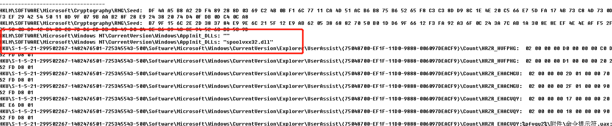
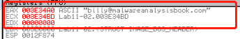

# <center>**恶意代码分析与防治技术实验报告**</center>

## <center>Lab11</center>

## <center> **网络空间安全学院 信息安全专业**</center>

## <center> **2112492 刘修铭 1063**</center>

https://github.com/lxmliu2002/Malware_Analysis_and_Prevention_Techniques

# 一、实验目的

1. 了解恶意代码的行为；
1. 进一步熟悉静态分析与动态分析的过程。


# 二、实验环境

为了保护本机免受恶意代码攻击，本次实验主体在虚拟机上完成，以下为相关环境：

1. 已关闭病毒防护的 Windows11
2. 在 VMware 上部署的 Windows XP 虚拟机
   * 在进行动态分析时，需对虚拟机做如下处理：
     * 对 VMware 进行快照，便于恢复到运行前的状态
     * 启动 ApateDNS，将 DNS Reply IP 设置为 127.0.0.1
     * 启动 Process Monitor，并按照实验要求设置过滤条件
     * 启动 Process Explorer
     * 启动 netcat：nc-l -p XXX
     * 启动 WireShark 抓取数据包


# 三、实验工具

1. 待分析病毒样本（解压缩于 XP 虚拟机）

2. 相关病毒分析工具，如 PETools、PEiD、Strings、OllyDbg、IDA等

3. WinDbg 内核调试工具

4. Yara 检测引擎


# 四、实验过程

## （一）Lab 11-1

### 1. 程序分析

使用 Strings 打开文件，查看其字符串。可以看到其中有许多 Wlx 开头的字符串，同时也看到 gina.dll，结合注册表的路径及  sys 驱动文件，推测其通过修改注册表拦截 GINA，借助驱动完成对应功能。


接着使用 Dependency Walker 查看其导入导出函数。可以看到与注册表操作相关的函数以及提取资源节的函数。


使用 PEview 打开文件，可以看到一个名为 FGAD 的资源节，与上面发现的函数向对应。点击，可以看到其中的 MZ、PE 头，说明其中包含一个 PE 文件。


打开 Procomon 可以看到其捕获到了恶意代码的行为。其创建了一个名为 msgina32.dll 的文件到恶意代码的同级目录下，同时恶意代码将该 dll 文件的路径写入到了注册表中。


通过借助 RegShot 对恶意代码运行前后进行快照，发现其确实更改了注册表，插入到了 GINA，使得系统启动时，WinLogon 会加载该 dll 文件。重启电脑，可以看到登录弹窗，由此推断，该恶意代码意图获取电脑的用户名与密码。


使用 IDA 分析该 dll 文件。可以发现其对参数 fdwReason 进行检查，如果不是1的话就退出；如果参数正确，则继续运行：通过调用 LoadLibraryW 函数获取 Windows 系统中 msgina.dll 的句柄，接着将其存入 hLibMoudle 中，这样的话就可以让恶意代码可以响应对 msgina.dll 的请求。因为 msgina32 拦截了 Winlogon 和 msgina 的通信，所以 msgina32 要协助分发正常的系统调用。


接着查看其导出函数。WLxLoggdOnSAS 函数首先传递字符串 WLxLoggdOnSAS 到 sub_10001000，然后跳转到程序入口地址处，传入 dll 文件的句柄和 WLxLoggdOnSAS 函数来使用 GetProcessAddress 解析 msgina 中的函数地址，然后跳转到该函数，通过跳转并调用WLxLoggdOnSAS，直接在 Winlogon 上运行。即 WlxLoggedOnSAS 函数输出恰好传递给 msgina.dll 中真正的 WlxLoggedOnSAS 函数。


接着查看上面提到的 sub_10001000 函数。可以看到，其用于通过函数名查找对应的跳转地址。


继续查看其他导出函数，可以发现与 WLxLoggdOnSAS  函数基本类似。但 WLxLoggdOutSA 函数将格式化字符串压栈，然后调用了 sub_10001570 函数。


接着查看 sub_10001570 函数。这个函数首先传入被当做参数传入的格式化字符串，然后打开 msutil32.sys 文件，因为 Winlogon 在 C:\Windows\System32 的目录下，所以这个文件也被创建在该目录下，接下来记录日期时间最后记录登录的凭证，因此得知，该 sys 文件并不是一个驱动文件，而是用来记录凭证信息的文件，sys 文件后缀是其一个伪装。


使用记事本打开该 sys 文件，可以看到其确实记录有上面重启登录时的信息。


### 2. 问题解答

#### （1）这个恶意代码向磁盘释放了什么？

该恶意代码从 TGDA 资源节释放出 msgina32.dll 文件，将其保存到恶意代码同级目录下。

#### （2）这个恶意代码如何进行驻留？

恶意代码将问题 1 中释放的 dll 文件路径写入到注册表 GINA 中，使得系统每次重启时都会加载，从而实现驻留。

#### （3）这个恶意代码如何窃取用户的登录凭证？

该恶意代码释放 dll 文件到注册表，使得重启时加载，该 dll 文件使用 GINA 拦截用户登录凭证。

#### （4）这个恶意代码对窃取的证书做了什么处理？

该恶意代码将窃取到的证书写入到创建在 C:\Windows\System32 目录下的 msutil32.sys 文件中。

#### （5）如何在你的测试环境让这个恶意代码获得用户的登录凭证？

注销或重启系统，再次登录，恶意代码即可获取用户的登录凭证。

## （二）Lab 11-2

### 1. 程序分析

使用 Strings 打开文件查看其字符串。可以看到 APPInit_DLLs 和一个注册表路径 SOFTWARE\Microsoft\WindowsNT\CurrentVersion\Windows，表明恶意代码使用 AppInit_DLLs 进行半永久安装。Lab11-02.ini 说明其使用了 ini 文件，而 RCPT 是一个命令，用来创建一个电子邮件的接收人。


然后查看 ini 文件，发现一个奇怪的字符串，推测已经加密。


接着使用 Dependency Walker 查看其导入导出函数。可以看到，其导入函数中有与注册表操作有关的 RegSetValueEx 函数，与拷贝文件的 CopyFile 函数，与搜索进程线程列表的 CreateToolhelp32Snapshot 函数。


有一个名叫 installer 的导出函数，猜测会安装一个进程。


使用 rundll32.exe Lab11-02.dll,install 指令执行该 dll 文件。procmon 捕获到其行为：恶意代码在系统目录下创建了一个名为 spoolvxx32.dll 的文件。经过对比分析，发现这个文件和 Lab11-02.dll 完全相同。同时注意到，恶意代码会请求打开系统目录下的 ini 文件，推测需将 Lab11-02.ini 移动到系统目录下。


Regshot 前后对比，可以发现恶意代码将 spoolvxx32.dll 添加到 AppInit_Dlls 列表中，使得恶意代码被加载到所有装载 User32.dll 的进程中。



使用 IDA 深入分析。首先分析唯一一个导出函数 installer。查看其交叉引用，可以看到其在注册表中添加了一个只，并且将一个文件复制到系统目录，与前面分析相匹配。所以该函数即用来将恶意代码复制到 spoolvxx32.dll 文件，然后将其设置为一个 APPlnit_DLLs 值。


接着分析 DllMain 函数。可以看到，其首先检查参数的状态，如果参数不符合要求，DllMain 函数将直接返回。


继续分析，发现其获取 Windows 的系统目录以及一个字符串代表的接下来的目录 lab11-02.ini，然后使用 strncat 函数将其拼接成一个完整路径，之后打开文件，如果打开失败将直接退出。


接着使用 OllyDbg 进行分析。可以看到，程序读取完 ini 文件的地址后再调用 strcat 函数，eax 中值为其完整路径。


逐步调试，可以看到程序解密得到 eamil 地址：billy@malwareanalysisbook.com。



返回 IDA 继续分析。可以看到，恶意代码将当前进程与 THEBAT.EXE、OUTLOOK.EXE 以及 MSIMN.EXE 进行比较，如果进程名不在其中就退出运行；否则就继续运行。


接着调用 sub_100013BD 函数，步入分析。首先调用了 GetCurrentProcessId 函数获得当前进程的标识符，然后调用 sub_100012FE 函数，调用 GetCurrentThreadId 函数用来返回当前线程的标识符，接下来调用 CreateToolhelp32SnapShot 且遍历当前进程的所有 Tid，如果 Tid 不是当前的线程就将其暂停。即该函数挂起了当前其他的线程。


返回主函数，结合上面分析可知，sub_100013BD 函数暂停了其他线程，之后又予以恢复。下面查看到中间的 sub_100012A3 函数。步入检查，可以看到其有四个参数。


函数通过 GetMoudleHandleA 获得 dll 的句柄，传递 send 函数地址和 sub_1000113D、dword_10003484 到 sub_10001203 函数。


在调用函数前，其计算 send 函数和 sub_1000113D 开始的内存地址之间的差，将其移到 var_4 变量之前，需要从中再减去 5 个字节，随后使用 var_4 的时候就可在前面直接加 jmp 跳转到 sub_1000113D 函数的位置。


继续分析，可以看到，send 函数的开头复制了 0E9h，即 jmp指令，然后将其赋值 var_4 到 0xe9 之后的内存，于是即可跳转到 DLL 中的 sub_1000113D 函数。


然后可以看到，VirtualProtect 函数修改了内存的运行以及读写权限，即修改恶意代码中的 send 函数的可执行性。函数末尾的 VirtualProtest 则恢复原有的保护，随后使用 alloc 函数分配 256 字节的内存并将结果保存在 Var_8 中。


下面分析这 256 字节。首先，使用 memcpy 复制 send 的前五个字节，确保其保存原始指令。接下来在 0E9h 和后面添加跳转地址，完成对跳转地址的初始化，最后在函数的末尾将全局变量 10003484 设置为该缓冲区的地址。挂钩函数在 buf 中查找字符串 RCPT TO，如果没有发现，则调用 send函数；否则向 billy@malwareanalysisbook.com 发送邮件。


### 2. 问题解答

#### （1）这个恶意 DLL 导出了什么？

该恶意代码导出了一个名叫 installer 的函数。

#### （2）使用 rundll32.exe 安装这个恶意代码后，发生了什么？

安装后，该恶意代码会复制自身以 spoolvxx32.dll 的名字到系统目录下，并添加键值到 AppInit_DLLs 列表中实现半永久安装；且其试图读取系统目录下的 ini 文件。

#### （3）为了使这个恶意代码正确安装，Lab11-02.ini 必须放置在何处？

必须放置到系统目录下。

#### （4）这个安装的恶意代码如何驻留？

被安装到 AppInit_DLLs 列表中，使其加载到所有装载 User32.dll 的进程中。

#### （5）这个恶意代码采用的用户态 Rootkit 技术是什么？

该恶意代码针对 send 函数进行了挂钩攻击。

#### （6）挂钩代码做了什么？

检查向外发送的包，如果包含 RCPT TO 字符串，则其将 billy@malwareanalysisbook.com 添加到收件人处，即将该其一同转发到 billy@malwareanalysisbook.com。

#### （7）哪个或者哪些进程执行这个恶意攻击，为什么？

该恶意攻击仅针对 MSIMI.EXE、THEBAT.EXE 和 OUTLOOK.EXE，经比较，以上三者均为电子邮件客户端。

#### （8）.ini 文件的意义是什么？

该文件包含一个加密的电子邮件地址，解密后是 billy@malwareanalysisbook.com。

#### （9）你怎样用 Wireshark 动态抓获这个恶意代码的行为？

抓取系统的网络数据包即可看到一个假冒的服务器以及 Outlook Press 客户端。

## （三）Lab 11-3

### 1. 程序分析

使用 Strings 检查文件字符串。可以看到 net start cisvc 指令，推测恶意代码会启动 cisvc 服务。同时还看到 dll 文件名和路径，以及一个奇怪的字符串 zzz69806582。


使用 Dependency Walker 分析导入导出函数。可以看到用来确认用户键盘按键的 GetAsyncKeyState 函数，用来获取用户系统最前端窗口的 GetForegroundwindow 函数。二者结合即可用于记录用户当前输入的窗口信息。


同时还发现了名为 zzz69806582 的导出函数。


查看 procomon，可以看到其捕捉到恶意代码的行为。恶意代码在 C:\Windows\System32\ 目录创建了 inet_epar32.dll 文件。经分析比较，可以确认该文件与 Lab11-03.dll 完全相同。还可以看到，恶意代码打开了 cisvc.exe 的句柄。


同时可以发现系统目录下多了一个 kernel64x.dll 文件，与前面字符串分析相吻合。


使用记事本打开该文件，可以看到之前的敲击记录，与前面分析相吻合。


接着使用 IDA 继续分析。可以看到其首先将 dll 文件复制到系统目录下并命名为 inet_epar32.dll，接着将 cisvc.exe 的句柄作为参数传递给 sub_401070 函数，然后使用 net start cisvc 指令启动服务。


步入分析 sub_401070 函数。借助交叉引用，可以看到这个函数调用 CreateFileA、CreateFileMappingA 和 CreateViewOfFile。CreateFile 函数将 cisvc.exe 映射到内存中，而 CreateFileMapping 函数用于创建一个文件映射内核对象，通过参数 hFile 指定待映射到进程地址空间的文件句柄（该句柄由 CreateFile 函数的返回值获取），第三个函数的作用则是将文件映射的视图映射到调用进程的地址空间，并且返回内存映射视图的基地址。然后在进行了一系列创建文件、加载文件到内存并且 unmap、得到基址之后写入到内存映射文件缓冲区。


接着分析 byte_409030 地址处的内容。可以看到，该部分由 C:\WINDOWS\System32\inet_epar32.dll 路径与 zzz69806582 字符串组成。说明其加载了 dll 并且调用其导出函数 zzz69806582。


比较 cisvc.exe 在恶意代码运行前后的区别，可以看到被感染后的文件发生了重定向。使用 OllyDbg 进行分析，可以看到其调用 LoadLibrar 函数将 inet_epar32.dll 载入内存。


返回 IDA，可以看到后面调用 CreateThread 函数创建线程。


接着调用 sub_10001030 函数，其中调用 GetAsyncKeyState 函数来获取键盘的输入，然后存储在 buffer 中并在最后由 buffer 统一写入 file 中。


同时可以看到这个恶意代码还创建了一个互斥量，确保只有一个进程监视键盘输入，避免多线程占用性能使自己被发现。


### 2. 问题解答

#### （1）使用基础的静态分析过程，你可以发现什么有趣的线索？

其包含服务启动指令以及若干 dll 文件。同时看到其有 GetAsyncKeyState、GetForegroundwindow 导入函数，用于记录键盘输入；以及一个奇怪的名为 zzz69806582 的导出函数。

可执行文件包含  l以及net start cisvc这意味着他可能启动了CiSvc索引服务，包含字符串一个位于系统目录的的Lab11-03.dll导入了API函数GetAsyncKeyState和GetForegroundwindow两个函数，这可能是一个击键记录器

#### （2）当运行这个恶意代码时，发生了什么？

将 Lab11-03.dll 文件复制到系统目录下新创建的 inet_epar32.dl 文件中，向 cisvc.exe 写入数据并启动服务，记录键盘输入到 kernel64x.dll 文件中。

#### （3）Lab11-03.exe 如何安装 Lab11-03.dll 使其长期驻留？

其对 cisvc.exe 进行重定向进行木马索引服务。

#### （4）这个恶意代码感染 Windows 系统的哪个文件？

感染了系统目录下的 cisvc.exe 文件。同时还创建了 inet_epar32.dl 和 kernel64x.dll 两个 dll 文件。

#### （5）Lab11-03.dll 做了什么？

记录键盘输入，并将其写到 kernel64x.dll 文件中。

#### （6）这个恶意代码将收集的数据存放在何处？

系统目录下的 kernel64x.dll 文件中。

## （四）yara规则

基于上述分析，编写得到如下yara规则：

```yara
rule lab1101exe{
strings:
	$string1 = "UN %s DM %s PW %s OLD %s" nocase
	$reg = "Software\\Microsoft\\Windows NT\\CurrentVersion\\Winlogon"
    $dll1 = "MSGina.dll"
    $dll2 = "GinaDLL"
condition:
    filesize < 100KB and uint16(0) == 0x5A4D and uint16(uint16(0x3C))==0x00004550 and all of them
}
rule lab1102dll{
strings:
    $reg1 = "SOFTWARE\\Microsoft\\Windows NT\\CurrentVersion\\Windows"
	$dll1 = "spoolvxx32.dll"
	$exe1 = "THEBAT.EXE"
    $exe2 = "OUTLOOK.EXE"
	$exe3 = "MSIMN.EXE"
condition:
    filesize < 100KB and uint16(0) == 0x5A4D and uint16(uint16(0x3C))==0x00004550 and all of them
}
rule lab1102ini{
strings:
    $string1 = "BNL"
condition:
    filesize < 100KB and all of them
}
rule lab1103exe{
strings:
	$dll1 = "C:\\WINDOWS\\System32\\inet_epar32.dll"
	$dll2 = "Lab11-03.dll"
    $exe1 = "cisvc.exe"
    $string1 = "net start cisvc"
    $func1 = "zzz69806582"
condition:
    filesize < 100KB and uint16(0) == 0x5A4D and uint16(uint16(0x3C))==0x00004550 and all of them
}
rule lab1103dll{
strings:
    $dll1 = "C:\\WINDOWS\\System32\\kernel64x.dll"
	$func1 = "VirtualAlloc"
    $func2 = "RtlUnwind"
	$sys1  = "Lab10-03.sys"
    $string1 = "<SHIFT>"
condition:
    filesize < 100KB and uint16(0) == 0x5A4D and uint16(uint16(0x3C))==0x00004550 and all of them
}
```

下面是运行结果图。


下面测试其运行效率，得到如下运行结果。


## （五）IDA Python脚本编写

遍历所有函数，排除库函数或简单跳转函数，当反汇编的助记符为call或者jmp且操作数为寄存器类型时，输出该行反汇编指令。

```python
import idautils
ea=idc.ScreenEA()
funcName=idc.GetFunctionName(ea)
func=idaapi.get_func(ea)
print("FuncName:%s"%funcName) # 获取函数名
print "Start:0x%x,End:0x%x" % (func.startEA,func.endEA) # 获取函数开始地址和结束地址
# 分析函数属性 
flags = idc.GetFunctionFlags(ea)
if flags&FUNC_NORET:
    print "FUNC_NORET"
if flags & FUNC_FAR:
    print "FUNC_FAR"
if flags & FUNC_STATIC:
    print "FUNC_STATIC"
if flags & FUNC_FRAME:
    print "FUNC_FRAME"
if flags & FUNC_USERFAR:
    print "FUNC_USERFAR"
if flags & FUNC_HIDDEN:
    print "FUNC_HIDDEN"
if flags & FUNC_THUNK:
    print "FUNC_THUNK"
if not(flags & FUNC_LIB or flags & FUNC_THUNK):# 获取当前函数中call或者jmp的指令
    dism_addr = list(idautils.FuncItems(ea))
    for line in dism_addr:
        m = idc.GetMnem(line)
        if m == "call" or m == "jmp":
            print "0x%x %s" % (line,idc.GetDisasm(line))
```

得到如下结果：


# 五、实验结论及心得

1. 熟悉了静态与动态结合分析病毒的方法；
1. 了解了恶意代码的行为；
1. 更加熟悉了yara规则的编写。
