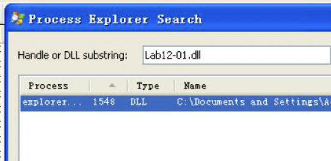
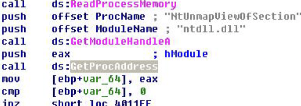

# <center>**恶意代码分析与防治技术实验报告**</center>

## <center>Lab12</center>

## <center> **网络空间安全学院 信息安全专业**</center>

## <center> **2112492 刘修铭 1063**</center>

https://github.com/lxmliu2002/Malware_Analysis_and_Prevention_Techniques

# 一、实验目的

1. 了解恶意代码的隐蔽启动；
1. 进一步熟悉静态分析与动态分析的过程。


# 二、实验环境

为了保护本机免受恶意代码攻击，本次实验主体在虚拟机上完成，以下为相关环境：

1. 已关闭病毒防护的 Windows11
2. 在 VMware 上部署的 Windows XP 虚拟机
   * 在进行动态分析时，需对虚拟机做如下处理：
     * 对 VMware 进行快照，便于恢复到运行前的状态
     * 启动 ApateDNS，将 DNS Reply IP 设置为 127.0.0.1
     * 启动 Process Monitor，并按照实验要求设置过滤条件
     * 启动 Process Explorer
     * 启动 netcat：nc-l -p XXX
     * 启动 WireShark 抓取数据包


# 三、实验工具

1. 待分析病毒样本（解压缩于 XP 虚拟机）

2. 相关病毒分析工具，如 PETools、PEiD、Strings、OllyDbg、IDA等

3. WinDbg 内核调试工具

4. Yara 检测引擎


# 四、实验过程

## （一）Lab 12-1

### 1. 程序分析

使用 Strings 打开文件，查看其字符串，可以看到 explorer.exe、lab12-01.dll 以及 psapi.dll 等，推测是恶意代码的一些目标文件。同时可以看到 Loadlibrary 等函数，推测恶意代码会使用这些函数进行攻击。


接下来使用 Dependency Walker 查看其导入导出函数，可以看到  CreateRemoteThread、WriteProcessMemory 以及 VirtualAllocEx 等函数，通常被恶意代码用来操作进程。


运行文件，可以看到其弹出消息框。


查看 Procomon，可以看到其捕获到了恶意代码的行为，可以看到其对 psapi.dll 进行了一些操作。


查看 Process explorer，可以看到 Lab12-01.dll 文件被加载到 explorer.exe 中。



使用 IDA 深入分析。可以看到，main 函数使用 LoadLibrary 以及 GetProcAddress 等函数将 psapi.dll 作为参数进行解析，并将结果保存在 dword_408714，dword_40870c，dword_408710 中。


继续分析，可以看到 dword_408710 被调用，用于获取系统中进程对象的 PID，并返回一个数组。


切换视图，可以看到其为一个循环结构，前面提到的数组被用于迭代进程列表。


查看循环结构体，可以看到每次都会调用 sub_401000 函数。


步入该函数进行分析。可以看到其首先调用 OpenProcess 打开进程，接着使用  MyEnumProcessModule 函数获取该进程的全部模块。


继续分析，可以看到其调用 GetModuleBaseNameA 将 PID 获取为进程名。而 call__strnicmp 则将获得的字符串与 explorer.exe 进行比较。即该部分用于查找 explorer.exe 进程。


继续分析，可以看到其调用 OpenProcess 打开其句柄。接着使用 push 104h 指令将 0x104 字节压栈，调用 VirtualAllocEx 进行内存分配，接着将 lpBaseAddress 和 hProcess 作为参数调用 WriteProcessMemory，向 explorer.exe 中写入 lpBufer 中的数据。


接着查看 lpBufer，可以看到是调用 GetCurrentDirectoryA 获取当前路径，并与 Lab12-01.dll 拼接，因此可以得知 lpBuffer 的内容就是 Lab12-01.dll 的路径。即将 Lab12-01.dll 写入到了explorer.exe 中，与前面现象相匹配。


返回继续分析，可以看到其先调用 WriteProcessMemory，写入之后则会调用 GetModuleHandleA 、GetProcAddress 用于获取 kernerl32.dll 中的LoadLibrary 的地址返回的地址，并将其赋给 lpStartAddress，接着将其作为参数调用 CreateRemoteThread 函数。基于此，explorer.exe 会使用 Lab12-01.dll 作为参数调用 LoadLibraryA。


接着使用 IDA 分析 dll 文件。可以看到其首先调用 CreateThread 函数创建线程。


下面步入分析其调用的 sub_10001030 函数。切换视图可以看到其为一个循环结构。循环体中同样调用 CreateThread 函数创建线程。接着以 60000 作为参数调用 Sleep 函数，即每次运行时间间隔一分钟。


步入查看 StartAddress 函数，可以看到其调用 MessageBoxA 函数创建消息提示框显示 Press OK to reboot，这与前面分析相吻合。


返回分析，可以看到 var_18 被赋初值为 0，运行后被被拼接到字符串后，每次循环自增。


### 2. 问题解答

#### （1）在你运行恶意代码可执行文件时，会发生什么？

每分钟在屏幕上弹出一个消息提示框，框标头会有计数。

#### （2）哪个进程会被注入？

该恶意代码会将 Lab12-01.dll 注入到 explorer.exe 中。

#### （3）你如何能够让恶意代码停止弹出窗口？

强制终止进程或重新启动系统。

#### （4）这个恶意代码样本是如何工作的？

该恶意代码执行 DLL 注入攻击，将 Lab12-01.dll 注入到 explorer.exe 中，使得每分钟弹出一个消息提示框并予以计数。

## （二）Lab 12-2

### 1. 程序分析

使用 Strings 查看文件字符串，可以看到许多 A 字符以及一些乱码串，推测其已经加密。


使用 Dependency Walker 查看其导入导出函数，可以看到一些与进程相关的函数，以及一些与资源节操作相关的函数。


接着使用 Resource Hacker 查看资源节中的内容。可以看到有一个资源节的类型是 UNICODE，
名字是 LOCALIZATION，点击查看，可以看到其中为一串乱码，推测进行加密处理，与前面字符串分析相吻合。


点击 CreateProcess 函数进入被调用的界面，参数为 4代表此进程被创建但是不被执行，除非主进程调用这个函数的时候才会被启动。


继续分析，可以看到其调用 GetThreadContext 函数，获取该进程的上下文。接着添加一个结构体以分析其访问的数据，可以发现 0A4h 即为上下文结构体中的一个参数，函数通过引用该参数获取 ebx 寄存器的值，而 ebx 中包含有指向进程指针的 peb 进程块。继续分析，发现其调用 GetProcAddress 函数获取 NtUnmapViewOfSection 函数的地址，接着将 Buffer 中的数据作为参数传入，释放新创建进程的内存空间以填充恶意代码。



继续分析，发现其进行字符串比较，可以看到其进行了 MZ 与 PE 两个字符串的比较，接着将 var_8 指向 PE 文件头的指针。


之后将 var_8 存储在到 ecx 中，再将 ecx 加上34h，通过查找PE文件结构图发现从基址加上 34h 就是映像基址的位置，即将映像基址存入 edx 中。而 edx 会作为 lpaddress 参数传入 VirtualAllocEx；另外还有 [edx+50h] 一同移入其中，经过分析可以发现其为内存中映像总大小 dwSize。调用函数，向内存中写入数据。推测该部分移动一个 PE 文件到另一个内存地址空间去。


继续分析，可以看到其在 ecx 的基础上加上了 6 偏移后放入 edx 寄存器中，现在此寄存器中存储的即为区段数。说明这段循环复制 PE 文件的可执行段到挂起进程里面。


继续分析，var_4 指向的是 PE 文件中 MZ 的位置，偏移 3C 后即指向 PE 标志位的偏移，故而该位置保存 PE 文件的偏移位标识，可以据此获获取 PE 文件头的位置，此时 ecx 中保存的即为 PE 文件头的位置。


继续分析，可以看到其调用了 SetThreadContext 函数，修改 eax 寄存器中的数据，将 eax 中的值设置为可执行文件的加载入口点。


接着其调用 ResumeThread 函数，将进程进行替换。向前查找，可以看到是将 svchost.exe 文件作为参数传递给了 sub_40149D 函数。步入分析，发现其调用了获取系统路径函数并且调用了 strcat 字符串连接函数。综上，推测其目的为构造 svchost.exe 路径，即有进程替换了 svchost.exe。


继续分析，发现其调用 sub_401000 函数。步入分析，可以看到其中有异或操作，对象为 arg_8，向前查找确定为 41h。接着即为解密操作。使用 WinHex 软件将从资源节中提取出的 exe 文件进行解密分析，可以看到 MZ、PE 等文件标识。


### 2. 问题解答

#### （1）这个程序的目的是什么？

该恶意代码隐蔽启动另一个程序。

#### （2）启动器恶意代码是如何隐蔽执行的？

其进行进程替换进行执行，即先将正常程序挂起，然后逐模块替换。

#### （3）恶意代码的负载存储在哪里？

其负载存储在程序的资源节中。

#### （4）恶意负载是如何被保护的？

其负载进行加密存储（异或编码）。

#### （5）字符串列表是如何被保护的？

字符串在 0x401000 处调用函数进行 XOR 编码保护。


## （三）Lab 12-3

### 1. 程序分析

首先使用 Strings 分析文件字符串。可以看到 Hook 相关的内容，推测其与挂钩有关。


接着使用 Dependency Walker 查看文件的导入导出函数，可以看到 SetWindowsHookExA 等函数，用于应用程序挂钩或监控 Windows  内部事件。


使用 IDA 进行进一步分析。可以看到其在 040105b 调用 SetWindowsHookExA 函数。第一个参数 idHook 的值为 0Dh，对应 WH_KEYBOARD_LL，用于监控键盘信息；第二个参数 lpfn 代表 hook 函数地址，在 IDA 中被标记为 fn，表示启用键盘事件监控。接着调用 GetMessageA 函数，记录击键信息。


下面分析 fn 函数，步入分析，可以看到其带有三个参数。WH_KEYBOARD_LL 回调函数实际上是 LOWLevelKeyboard Proc 回调函数。接着在 0040108f，00401098 处有两个 cmp 比较，涉及到的常量分别为 100h，104h。


接着将虚拟按键码作为参数传到到函数 sub_4010c7 中。继续步入分析，可以看到其调用 CreateFileA 函数创建或打开一个 log 文件。


继续分析，可以看到其调用 GetForegropundWindow 函数获取按键时的活动窗口，调用 GetWindowTextA 获取窗口标题，以此获取其上下文。


继续分析，看到到这里的 var_c 由 Buffer 传入，下面着重分析。


可以看到传入的参数实际上就是虚拟按键码。回溯，继续分析，可以看到跳转表，在 00401220 看到虚拟按键码作为一个查询表的索引。查表得到的值作为跳转表 off_401441 的一个索引，加上当前的按键为 shift，其虚拟按键码为 0x10， 回到 00401202 处重新分析。此时 var_c 为 0x10，而 0040120b 处将该值减去 8，它的值就变为了 8。


vac_c 中存的值为 8，在 byte_40148d 找相应的偏移，双击跟入。由于这是一个数组，偏移为 8，实际是第 9 个，也就是 3，然后根据地址 00401226 处的指令，将 12 作为 off_401441 的偏移量，继续跟入。


发现其将 SHIFT 写入 log。


### 2. 问题解答

#### （1）这个恶意负载的目的是什么？

该恶意代码的负载实现了一个键盘敲击记录器。

#### （2）恶意负载是如何注入自身的？

该恶意代码使用 Hook 挂钩窃取击键记录。

#### （3）这个程序还创建了哪些其他文件？

其创建了 praticalmalwareanalysis.log 日志文件，并将记录写入其中。

## （四）Lab 12-4

### 1. 程序分析

使用 Strings 查看文件字符串，可以看到一些与注册表相关的字符串，还可以看到 winlogon.exe 等字符串。


使用 Dependency Walker 查看导入导出函数，可以看到用于创建远程线程的 CreateRemoteThread 和用于操作资源的 LoadResource 函数。使用 Resource Hacker 查看资源，可以看到 MZ、PE 等信息，确定为一个 PE 文件。


运行文件，可以看到 Process Monitor 捕获到恶意代码行为。其对 Temp 文件夹进行一定操作，之后更新了 wupdmgr.exe 文件。经过对比分析，确认与前面资源节中文件完全相同。


查看 WireShark，可以看到该恶意代码向 www.practicalmalwareanalysis.com 网站发送 GET 请求，用以下载 updater。


下面使用 IDA 进行分析。可以看到其通过 LoadLibraryA 和 GetProcAddress 解析三个函数，并将三个函数指针分别保存在  dword_40312c。


继续分析，可以看到其使用 muEnumProcess 列出当前进程，返回 PID，保存到 dwProcessID 中。


接着为一个循环结构，遍历 PID，将其作为参数传递给 sub_401000。步入分析，可以看到 Str1 和 Str2 两个字符串。接着调用函数，将其返回值进行比较。


下面分析 sub_401174 函数，可以看到其调用 sub_4010FC，继续步入分析，可以看到其调用 lookupPrivilegeValueA 函数用于提升权限。


返回分析，可以看到其调用 LoadLibraryA 函数用于装载 sfc_os.dll，然后借助 GetProcAddress 函数获取其中编号为 2 的函数地址保存到 lpStartAddress 中，调用 OpenProcess 打开 winLogon.exe，将其句柄保存到 hProces。


接着，该调用 CreateRemoteThread 函数，其 hProcess 参数是 winlogon.exe 的句柄。004011de 处的 lpStartAddress 是 sfc_os.dll 中序号为 2 的函数的指针，负责向 winlogon.exe 注入一个线程，而该线程就是 sfc_os.dll 的序号为 2 的函数。


接着调用资源节，写入到 C:\windows\system32\wupdmgr.exe。


继续分析，可以看到恶意代码通过 WinExec 来启用已经被改写过的 wupdmgr.exe。在 0040133c 处可以看到 push 0 指令，将 0 作为 uCmdShow 参数值来启动，从而实现隐藏程序窗口的目的。


### 2. 问题解答

#### （1）位置 0x401000 的代码完成了什么功能？

判断进程是否为 winlogon.exe 进程。

#### （2）代码注入了哪个进程？

注入了 winlogon.exe 进程。

#### （3）使用 LoadLibraryA 装载了哪个 DLL 程序？

装载了 sfc_os.dll 文件，用于禁用 Windows 的文件保护机制。

#### （4）传递给 CreateRemoteThread 调用的第 4 个参数是什么？

指向 sfcos.dll 中序号为 2 的函数的函数指针。

#### （5）二进制主程序释放出了哪个恶意代码？

恶意代码释放文件，将复制 wupdmgr.exe 到 %TEMP% 目录，然后覆盖原来的 wupdmgr.exe。

#### （6）释放出恶意代码的目的是什么？

恶意代码向 winlogon.exe 注入一个远程线程，并且调用 sfc_os.dl 的一个序号为 2 的函数，在下次启动之前禁用 Windows 的文件保护机制。恶意代码通过这个文件来更新自己的恶意代码，并且调用原始的二进制文件来特洛伊木马化 wupdmgr.exe 文件。


## （五）yara规则

基于上述分析，编写得到如下yara规则：

```yara
rule lab1201exe{
strings:
	$dll1 = "Lab12-01.dll"
	$string1 = "GetModuleBaseNameA"
    $dll2 = "psapi.dll"
    $string2 = "EnumProcessModules"
condition:
    filesize < 200KB and uint16(0) == 0x5A4D and uint16(uint16(0x3C)) == 0x00004550 and all of them
}
rule lab1202exe{
strings:
    $reg1 = "AAAqAAApAAAsAAArAAAuAAAtAAAwAAAvAAAyAAAxAAA"
	$dll1 = "spoolvxx32.dll"
	$exe1 = "svchost.exe"
    $string = "NtUnmapViewOfSection"
condition:
    filesize < 200KB and uint16(0) == 0x5A4D and uint16(uint16(0x3C)) == 0x00004550 and all of them
}
rule lab1203exe{
strings:
	$log = "practicalmalwareanalysis.logl"
	$func = "VirtualAlloc"
    $string1 = "TerminateProcess"
    $string2 = "[Window:"
condition:
    filesize < 200KB and uint16(0) == 0x5A4D and uint16(uint16(0x3C)) == 0x00004550 and all of them
}
rule lab1204exe{
strings:
    $log = "http://www.practicalmalwareanalysis.com//updater.exe"
	$exe1 = "wupdmgrd.exe"
	$exe2  = "winup.exe"
    $string1 = "<SHIFT>"
    $string2 = "%s%s"
condition:
    filesize < 200KB and uint16(0) == 0x5A4D and uint16(uint16(0x3C)) == 0x00004550 and all of them
}
```

下面是运行结果图。


下面测试其运行效率，得到如下运行结果。


## （六）IDA Python脚本编写

遍历所有函数，排除库函数或简单跳转函数，当反汇编的助记符为call或者jmp且操作数为寄存器类型时，输出该行反汇编指令。

```python
import idautils
ea=idc.ScreenEA()
funcName=idc.GetFunctionName(ea)
func=idaapi.get_func(ea)
print("FuncName:%s"%funcName) # 获取函数名
print "Start:0x%x,End:0x%x" % (func.startEA,func.endEA) # 获取函数开始地址和结束地址
# 分析函数属性 
flags = idc.GetFunctionFlags(ea)
if flags&FUNC_NORET:
    print "FUNC_NORET"
if flags & FUNC_FAR:
    print "FUNC_FAR"
if flags & FUNC_STATIC:
    print "FUNC_STATIC"
if flags & FUNC_FRAME:
    print "FUNC_FRAME"
if flags & FUNC_USERFAR:
    print "FUNC_USERFAR"
if flags & FUNC_HIDDEN:
    print "FUNC_HIDDEN"
if flags & FUNC_THUNK:
    print "FUNC_THUNK"
if not(flags & FUNC_LIB or flags & FUNC_THUNK):# 获取当前函数中call或者jmp的指令
    dism_addr = list(idautils.FuncItems(ea))
    for line in dism_addr:
        m = idc.GetMnem(line)
        if m == "call" or m == "jmp":
            print "0x%x %s" % (line,idc.GetDisasm(line))
```

得到如下结果：


# 五、实验结论及心得

1. 熟悉了静态与动态结合分析病毒的方法；
1. 了解了恶意代码的隐蔽启动相关内容；
1. 更加熟悉了yara规则的编写。
