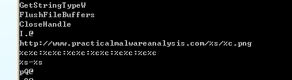

# <center>**恶意代码分析与防治技术实验报告**</center>

## <center>Lab14</center>

## <center> **网络空间安全学院 信息安全专业**</center>

## <center> **2112492 刘修铭 1063**</center>

https://github.com/lxmliu2002/Malware_Analysis_and_Prevention_Techniques

# 一、实验目的

1. 了解恶意代码的网络特征；
1. 进一步熟悉静态分析与动态分析的过程。


# 二、实验环境

为了保护本机免受恶意代码攻击，本次实验主体在虚拟机上完成，以下为相关环境：

1. 已关闭病毒防护的 Windows11
2. 在 VMware 上部署的 Windows XP 虚拟机
   * 在进行动态分析时，需对虚拟机做如下处理：
     * 对 VMware 进行快照，便于恢复到运行前的状态
     * 启动 ApateDNS，将 DNS Reply IP 设置为 127.0.0.1
     * 启动 Process Monitor，并按照实验要求设置过滤条件
     * 启动 Process Explorer
     * 启动 netcat：nc-l -p XXX
     * 启动 WireShark 抓取数据包


# 三、实验工具

1. 待分析病毒样本（解压缩于 XP 虚拟机）

2. 相关病毒分析工具，如 PETools、PEiD、Strings、OllyDbg、IDA等

3. WinDbg 内核调试工具

4. Yara 检测引擎


# 四、实验过程

## （一）Lab 14-1

### 1. 程序分析

使用 PEiD 查看，可以发现文件未被加壳。


接着使用 Strings 分析文件字符串，可以看到 Base64 编码格式字符串，可能用于进行加密；可以看到一些与网络资源相关的字符串，推测其会联网请求网络资源。




接着使用 Dependency Walker 查看其导入导出函数，可以看到来自 urlmon.dll 的 URLDownloadToCacheFileA 函数，用来从 url 中下载文件到缓存函数。


使用 IDA 分析程序。定位到 URLDownloadToCacheFileA 函数的调用，可以看到其访问的 URL 为 http://www.practicalmalwareanalysis.com/%s/%c.png，可以发现这个是一个格式化字符串，并且最后是以 png 结尾，也就是说这个访问的资源应该是一个图片。在此上面，即为对字符串进行格式化的一些操作。且此处的 %c 会一直是前面 %s 的最后一个字符。


深入分析调用，可以发现参数的内容来自上一个函数。


之后在其中发现有对 byte_4050C0 的多次调用。


步入分析，发现其为 Base64 编码。


经过分析，发现其区别于 Base64编码，使用字符 a 进行填充。


继续分析 main 函数，可以发现，在格式化字符串的时候，获取了计算机的唯一标识：硬件配置文件。然后获取的是用户名，并将这两个拼接成一个字符串作为第一个%s的参数。那么也就是说这里获取到的元素就是用户设备的唯一标识和用户名，当用户的主机或者是登录用户发生变化时，这个源才会发生变化。


返回刚才的函数，可以看到其调用 URLDownloadToCacheFileA 函数，下载文件，下载结束后为其创建进程，使其能够运行。

### 2. 问题解答

#### （1）恶意代码使用了哪些网络库？它们的优势是什么？

该程序中包含了 URLDownloadToCacheFile 函数，而这个函数使用了 COM 接口。当恶意代码使用 COM 接口时，HTTP 请求中的大部分内容都来自 Windows 内部，因此无法有效地使用网络特征来进行针对性的检测。

#### （2）用于构建网络信令的信息源元素是什么，什么样的条件会引起信令的改变？

信息源元素是主机 GUID 与用户名的一部分。GUID 对于任何主机操作系统都是唯一的，信令中使用了 GUID 中的 6 个字节，应该也是相对唯一的。用户名则会根据登录系统的用户而改变。

#### （3）为什么攻击者可能对嵌入在网络信令中的信息感兴趣？

攻击者可能想跟踪运行下载器的特定主机，以及针对特定的用户。

#### （4）恶意代码是否使用了标准的 Base64 编码？如果不是，编码是如何不寻常的？

不是标准的 Base64 编码，因为它在填充时，使用 a 代替 = 作为填充符号。

#### （5）恶意代码的主要目的是什么？

这个恶意代码下载并运行其他代码。

#### （6）使用网络特征可能有效探测到恶意代码通信中的什么元素？

恶意代码通信中可以作为检测目标的元素包括域名、冒号以及 Base64 解码后出现的破折号，以及 URI 的 Base64 编码最后一个字符是作为 PNG 文件名单字符的事实。

#### （7）分析者尝试为这个恶意代码开发一个特征时，可能会犯什么错误？

防御者如果没有意识到操作系统决定着这些元素，则他们可能会尝试将 URI 以为的元素作为目标。多数情况下，Base64 编码字符串以 a  结尾，它通常使文件名显示为.png。然而，如果用户名长度是 3 的倍数，那么最后一个字符和文件名都取决于编码用户名的最后一个字符。这种情况下，文件名是不可预测的。

#### （8）哪些特征集可能检测到这个恶意代码（以及新的变种）？

在恶意代码进行格式化字符串时，中间使用的是 : 进行分割，那么这个就可以作为一个特征，但是在使用这个的时候需要注意的是他会进行一个编码，在编码之后会变为 6，因为有破折号的使用，所以第 6 个四字符组是以 t 结尾。
根据以上的分析，可以得到以下的 snort 规则

```shell
alert tcp $HOME_NET any -> $EXTERNAL_NET $HTTP_PORTS (msg:"PM14.1.1 Colons and dash"; urilen:>32; content:"GET|20|/"; depth:5; pare:"/GET\x2-\/[A-Za-z0-9+\]{3}6[A-Za-z0-9+\]{3}6[A-Za-z0-9+\]{3}6[A-Za-z0-9+\]{3}6[A-Za-z0-9+\]{3}6[A-Za-z0-9+\]{3}t([A-Za-z0-9+\]{4}){1,}\//"; sid:20001411; rev:1;)
```

这个规则只包含了开头的关于 GET 字符串的内容。还有一个 snort 规则为：

```shell
alert tcp $HOME_NET any -> $EXTERNAL_NET $HTTP_PORTS (msg:"PM14.1.1 Base64 and png"; urilen:>32; uricontent:".png"; pcre:"/\/[A-Za-z0-9+\]{24,}([A-Zaz0-9+\])\/\1\.png/"; sid:20001412; rev:1;)
```

## （二）Lab 14-2

### 1. 程序分析

使用 PEiD 查看文件，可以发现文件未加壳。


接着使用 Strings 查看文件字符串，可以看到 Base64 加密字符串，推测其会采用 Base64 加密；同时还看到一些网络资源字符串，推测其会访问网络资源。


使用 Dependency Walker 查看其导入导出函数，可以看到与 shell 相关的 dll 以及与网络操作相关的 dll。


使用 Resource Hacker 查看资源节，可以看到网络资源的地址。与前面字符串分析相吻合。


运行文件，可以看到 Wireshark 中捕获到数据。


接着使用 IDA 进行分析。可以看到 Main 函数首先加载资源中的字符串并保存到 Buffer 缓冲区中。


然后将其赋值到 v4 中，同时创建两个管道，将 v4 作为输入与输出。


管道的另一端则是进程信息 StartupInfo 结构体，通过创建一个新的 cmd 进程来实现管道通信。即 cmd 通过管道接收缓冲区 Buffer 的数据进行执行，然后将执行的结果通过管道传输到缓冲区中。


接着以 StartAddress 为地址创建一个线程。


步入分析，可以看到此部分会读取管道的数据，然后利用函数 sub_401000 进行 Base64 加密，并将加密后的数据保存在 v3 中。


接着调用函数 sub_401750 对加密后的数据进行操作。而该函数拥有两个参数，一个是加密后的数据，另一个追溯回去正是缓冲区原始的数据，但是存在 0x14 字节的偏移，即网络资源的字符串。


步入 sub_401750 函数分析。可以看到其将加密后的数据作为 HTTP 协议中的 User-Agent 字段访问指定的 URL。


回到调用前，可以看到其先调用 sub_401000，需要接收两个参数。步入分析，可以看到其中大量使用 byte_401030 位置的内容。


继续分析，可以看到整个逻辑进行分支，一个分支调用函数 TerminateThread 终止进程，另一分支创建另一个线程，线程起始地址是 sub_4015C0。


双击跳转，可以看到此处存放一个字符串，正是前面字符串分析中发现的与 Base64 相近的字符串。


步入分析，可以看到一个 for 循环，循环体中不断利用函数 sub_401800 进行网络访问。


而该函数也是从管道中进行读取，并且读取的偏移都是 0x14h 指定的 URL，跟进分析。


循环体中除 sub_401800 函数，还对网络数据进行了缓存。


在调用完这个的后面我们可以看见这里和 exit 字符串进行了一个比较，可以看见这里其实就是一个反向 shell，接收远端的指令。当远端输入的是 exit 关键字，本次通信就会被终止，并且我们发现通信在终止之后程序会调用函数 sub_401880 来删除自身


### 2. 问题解答

#### （1）恶意代码编写时直接使用 IP 地址的好处和坏处各是什么？

攻击者可能会发现静态 IP 地址比域名更难管理。使用 DNS 允许攻击者将他的系统部署到任意一台计算机上，仅仅改变 DNS 地址就可以动态地重定向他的僵尸主机。对于这两种类型的基础设施，防御者有不同选项来部署防御系统。但是由于同样的原因，IP 地址比域名更难处理。这个事实会让攻击者选择静态 IP 地址，而不是域名。

#### （2）这个恶意代码使用哪些网络库？使用这些库的好处和坏处是什么？

恶意代码使用了 WinINet 库。这些库的缺点之一就是需要提供一个硬编码的 User-Agent 字段，另外，如果需要的话，它还要硬编码可选的头部。相比于 Winsock API，WinINet 库的一个优点是对于一些元素，比如 cookie 和缓存，可以由操作系统提供。

#### （3）恶意代码信令中 URL 的信息源是什么？这个信息源提供了哪些优势？

PE 文件中的字符串资源节包含一个用于命令和控制的 URL。在不重新编译恶意代码的情况下,可以让攻击者使用资源节来部署多个后门程序到多个命令与控制服务器位置。

#### （4）恶意代码利用了 HTTP 协议的哪个方面，来完成它的目的？

攻击者滥用 HTTP 的 User-Agent 域，它应该包含应用程序的信息。恶意代码创建了一个线程，来对这个域传出信息进行编码，以及另一个线程，使用静态域表示它是通道的“接收”端。

#### （5）在恶意代码的初始信令中传输的是哪种信息？

初始的信令是一个编码后的 shell 命令行提示。

#### （6）这个恶意代码通信信道的设计存在什么缺点？

尽管攻击者对传出信息进行编码，但他并不对传入命令进行编码。此外，由于服务器必须通过 User-Agent 域的静态元素，来区分通信信道的两端，所以服务器的依赖关系十分明显，可以将它作为特征生成的目标元素。

#### （7）恶意代码的编码方案是标准的吗？

编码方案是 Base64，但是使用一个自定义的字母。

#### （8）通信是如何被终止的？

使用关键字 exit 来终止通信。退出时恶意代码会试图删除自己。

#### （9）这个恶意代码的目的是什么？在攻击者的工具中，它可能会起到什么作用？

这个恶意代码是一个小且简单的后门程序。它的唯一目的是给远端的攻击者提供一个 shell 命令接口，而通过查看出站 shell 命令活动的常见网络特征不能监测到它。基于它尝试删除自己这个事实，我们推断这个特殊的恶意代码可能是攻击者工具包中的一个一次性组件。

## （三）Lab 14-3

### 1. 程序分析

使用 PEiD 查看文件，可以发现文件未加壳。


接着使用 Strings 分析文件中字符串。可以看到与网络请求有关的字符串；同时也看到与 Base64 相似的编码字符串。


使用 Dependency Walker 查看文件，可以看到与资源下载有关的函数。


运行文件，可以看到 Wireshark 中捕获到其 GET 请求。在 User-Agent 这里出现了重复，也就是其 User-Agent 构造的时候可能出了一些问题，导致这里出现了重复的字段。


使用 IDA 分析。首先查看其 main 函数，可以看到首先调用 sub_401457 函数。


接着又调用 sub_4011F3、sub_401684 与 Sleep 函数。但是其整体上是一个循环结构，执行一段时间后会休眠一段时间。


接着步入分析 sub_401457  函数。可以看到其试图打开系统目录中的 autobat.exe 文件。


如果打开失败会进入到一个和 url 有关的行为，然后执行写文件的操作。


之后回到刚才的位置重新打开。


如果打开成功就会读取文件，并将其中的内容放到 lpBuffer 中。


之后这个 Buffer 被作为参数传递给下一个函数，而这个函数就是前面分析的进行网络行为的函数。即刚刚的那个 autobat.exe 就是用来明文存储这个 url 的文件，这个 url 采用的是硬编码的方式存储，可能会因为编码方式的改变而发生改变，所以不适合长期驻留。


接着可以看见一个用来读取的函数，读取结束之后调用 _strstr 函数寻找第一次出现 <no 的位置.


然后进入到 sub_401000 函数。


步入分析，可以分析其进行字符串对比，即对输入进行一个比对，看是否是想要的字符串。但是发现检查的顺序是乱的，也就是经过了一定的混淆，并不能直接就看出来想要的指令是什么。经过分析我们发现这个字符串是 noscript 。


接着看到其调用函数用来确认是否为 url。


接着寻找 96’。即这个恶意样本通过 web 页面上的 noscript 的某个组件来获得命令，这个方法使得恶意样本能向合法的网站发送信令，并接收合法的内容，相当于进行了混淆，加大了分析的难度。


接着可以看到其最后调用的函数，其中有一个转换表。


可以看到，其中 Switch 的内容为减去字符 d 的值。


可以看到此处有四种情况。case 0 时，即以字符 d 开头。


步入分析，可以看见这个里面的内容就是从 url 上下载一个文件，并执行这个文件。


当以字符 n 开头时，可以看到程序退出。


当以字符 s 开头时。程序会调用 sub_401613 函数。


步入分析，可以看到该函数即为休眠函数。


当以字符 r 开头时。


可以看到其在系统目录下创建并写文件。


前面有一个函数未分析。


步入分析。可以发现这个函数首先获取了字符串的长度，然后进入循环。


循环中有一个地址调用，双击跳转，发现是类似于 Base64 编码的另一种编码方式，这里只保留了小写字母，而没有使用大写字母。


### 2. 问题解答

#### （1）在初始信令中硬编码元素是什么？什么元素能够用于创建一个好的网络特征？

硬编码的头部包括 Accept、Accept-Language、UA-CPU、Accept-Encoding 和 User-Agent。恶意代码错误地添加了一个额外的 User-Agent，在实际的 User-Agent 中，会导致重复字符串：Jser-Agent：User-Agent：Mozilla…针对完整的 User-Agent 头部 (包括重复字符串)，可以构造一个有效的检测特征。

#### （2）初始信令中的什么元素可能不利于可持久使用的网络特征？

当且仅当配置文件不可用时，域名和 URL 路径都会采用硬编码。这个硬编码的 URL 应该与所有配置文件一起构造特征。然而，以硬编码组件为检测目标，比结合硬编码组件与动态 URL 链接，检测效果可能会更好。因为使用的 URL 存储在配置文件中，并且随着命令而改变，所以它是临时的。

#### （3）恶意代码是如何获得命令的？本章中的什么例子用了类似的方法？这种技术的优点是什么？

恶意代码从 Web 页面上 noscript 标签中的某些特定组件来获得命令，这与本章中提到的注释域例子类似。使用这种技术，恶意代码可以向一个合法的网页发出信令，并且接收合法内容，这使防御者区分恶意流量与合法流量变得更加困难。

#### （4）当恶意代码接收到输入时，在输入上执行什么检查可以决定它是否是一个有用的命令？攻击者如何隐藏恶意代码正在寻找的命令列表？

要将内容解析为命令，必须包含被完整 URL（包括 http://）跟随的初始 noscript 标签，此 URI 包含的域名与原始网页请求的域名相同。此 URL 路径必须以 96 结尾。域名和 96（其中被截断）之间的两部分组成了命令和参数（如 /command/1213141516 类似的形式）。命令的第一个字母必须与提供命令相对应，在合适的时候，参数必须翻译成给定的命令中有意义的参数。接着用独立不规则的字符比较操作来确定 noscript 标签。恶意代码也复用了域名所使用的缓冲区，来检查命令的内容。此外对 96 的字符串搜索只有三个字符，另外唯一的单字符串搜索是字符 /。当匹配命令时，仅仅考虑第一个字符，所以攻击者可能会在 Web 响应中提供 soft 或者 seller，而实际上给恶意代码下达的是休眠的命令。流量分析可能确认攻击者在使用单词 soft 发送一个命令给恶意代码，而这可能会误导分析者在特征中使用完整单词。攻击者在不修改恶意代码的情况下，就可以无限制地使用 seller 或者任意以 s 开头的单词。

#### （5）什么类型的编码用于命令参数？它与 Base64 编码有什么不同?它提供的优点和缺点各是什么？

参数使用的是自定义编码，虽然简单但不是 Base64 编码。参数由偶数个数字来进行表示（一旦尾部的 96 被删除）。每组两个数字代表的原始数字是数组 /abcdefghijklmnopqrstuvwxyz0123456789：.的索引。这些参数仅用于 URL 间的通信，所以没有必要用到大写字符。这种编码方案的好处是：它不是标准算法，所以要理解它的内容，需要逆向工程分析它。缺点是很简单：在字符串输出中它可能被识别为可疑，因为 URL 总是以相同方式开头

#### （6）这个恶意代码会接收哪些命令？

恶意代码命令包括 quit、 download、 sleep 和 redirect。quit 命令就是简单退出程序 download 命令是下载并且运行可执行文件，不过与以前的实验不同，这里攻击者可以指定 URL下载。redirect 命令修改了恶意代码使用的配置文件，因此导致了一个新的信令 URL。

#### （7）这个恶意代码的目的是什么？

这个恶意代码本质上就是一个下载器。它有一些重要的优点，例如基于 Web 的控制，在确认为恶意域名并关闭后很容易做出调整。

#### （8）本章介绍了用独立的特征，来针对不同位置代码的想法，以增加网络特征的鲁棒性。那么在这个恶意代码中，可以针对哪些区段的代码，或是配置文件，来提取网络特征？

恶意代码行为中某些特殊元素可能作为独立的检测目标，比如：

* 与静态定义的域名和路径，以及动态发现的URL中相似信息有关的特征。与信令中静态组件有关的特征。
* 能够识别命令初始请求的特征。
* 能够识别命令与参数对特定属性的特征

#### （9）什么样的网络特征集应该被用于检测恶意代码？

前面分析可知，在 User-Agent 中多出了 User-Agent 的字样；还有 Accept 等相关的特征集也可以被用来检测。

根据 user-agent 编写 snort 规则如下：

```shell
alert tcp $HOME_NET any -> $EXTERNAL_NET $HTTP_PORTS (msg:"PM14.3.1 Specific User-Agent with duplicate header"; content:"User-Agent|3a20|User-Agent|3a20|Mozilla/4.0|20|(compatible\;|20|MSIE|20|7.0\;|20|Windows|20|NT|20|5.1\;|20|.NET|20|CLR|20|3.0.4506.2152\;|20|.NET|20|CLR|20|3.5.30729)"; http_header; sid:20001431;rev:1;)
```

同时还注意到，在最后的时候有一条 sleep 命令，对这个命令编写一个特征进行检测：

```shell
alert tcp $EXTERNAL_NET $HTTP_PORTS -> $HOME_NET any (msg:"PM14.3.4 Sleep Command"; content:96'"; pcre:"/\/s[^\/]{0,15}\/[0-9]{2,10}96'/"; sid:20001434; rev:1;)
```

## （四）yara规则

基于上述分析，编写得到如下yara规则：

```yara
rule lab1401exe{
strings:
	$string1 = "http://www.practicalmalwareanalysis.com/%s/%c.png"
	$string2 = "%c%c:%c%c:%c%c:%c%c:%c%c:%c%c"
	$string3 = "%s-%s"
	$string4 = "I.@"
condition:
    filesize < 200KB and uint16(0) == 0x5A4D and uint16(uint16(0x3C)) == 0x00004550 and all of them
}
rule lab1402exe{
strings:
    $string1 = "WXYZlabcd3fghijko12e456789ABCDEFGHIJKL+/MNOPQRSTUVmn0pqrstuvwxyz"
    $string2 = "COMSPEC"
    $string3 = "http://127.0.0.1/tenfour.html"
condition:
    filesize < 200KB and uint16(0) == 0x5A4D and uint16(uint16(0x3C)) == 0x00004550 and all of them
}
rule lab1403exe{
strings:
	$string1 = "http://www.practicalmalwareanalysis.com/start.htm"
	$string2 = "autobat.exe"
	$string3 = "Accept-Language: en-US"
condition:
    filesize < 200KB and uint16(0) == 0x5A4D and uint16(uint16(0x3C)) == 0x00004550 and all of them
}
```

下面是运行结果图。


下面测试其运行效率，得到如下运行结果。


## （五）IDA Python脚本编写

解密 Base4 加密内容。

```python
import string, base64
result = ""
tab = "XYZlabcd3fghijko12e456789ABCDEFGHIJKL+/MNOPQRSTUVmn0pqrstuvwxyz"
standardBase64 =
"ABCDEFGHIJKLMNOPQRSTUVWXYZabcdefghijklmnopqrstuvwxyz0123456789+/"
text = "e6LJC+xnBq90daDNB+1TDrhG6aUG6p9LC/iNBqsGi2sVgJdqhZXDZoMMomKGoqxUE7"
for i in text:
	if i in tab:
		s += standardBase64[string.find (tab, str (ch))]
	elif i == '=':
		s += '='
print(base64.decodestring(a))
```

得到如下结果：


# 五、实验结论及心得

1. 熟悉了静态与动态结合分析病毒的方法；
1. 了解了恶意代码网络特征的相关内容；
1. 更加熟悉了yara规则的编写。
