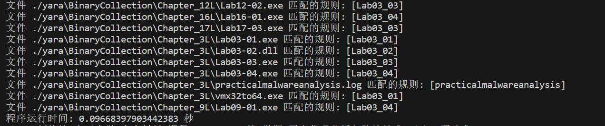

# <center>**恶意代码分析与防治技术实验报告**</center>

## <center>**Lab3**</center>

## <center> **网络空间安全学院 信息安全专业**</center>

## <center> **2112492 刘修铭 1063**</center>

https://github.com/lxmliu2002/Malware_Analysis_and_Prevention_Techniques

# 一、实验目的

1. 使用动态分析技术完成对给定病毒样本的分析；
1. 熟悉虚拟机、Yara等的操作。


# 二、实验环境

为了保护本机免受恶意代码攻击，本次实验主体在虚拟机上完成，以下为相关环境：

1. 已关闭病毒防护的Windows11
2. 在VMware上部署的Windows XP虚拟机
   * 在进行动态分析时，需对虚拟机做如下处理：
     * 对VMware进行快照，便于恢复到运行前的状态
     * 启动ApateDNS，将DNS Reply IP设置为127.0.0.1
     * 启动Process Monitor，并按照实验要求设置过滤条件
     * 启动Process Explorer
     * 启动netcat：nc-l -p XXX
     * 启动wireShark抓取数据包


# 三、实验工具

1. 待分析病毒样本（解压缩于XP虚拟机）

2. 相关病毒分析工具，如PETools、PEiD、Strings等
3. Yara检测引擎


# 四、实验过程

本次实验主要基于动态分析，但在动态分析之前需要先对其进行静态分析，掌握文件的整体情况。故而整体的实验思想为，先静态再动态。

## （一）Lab3-1

### 1.静态分析

使用PEiD打开，检测加壳信息。如图所示，可以看到壳为PEncrypt 3.1 Final -> junkcode


使用Dependency Walker打开文件，查看其导入函数。可以看到，仅有一个ExitProcess。而单凭这一个函数无法使这个程序正常运行，结合以上，确定该文件出现了加壳。


下面使用Strings查看文件的字符串，可以看到一些诸如WinVMX32、VideoDriver、vmx32to64.exe、注册表位置、注册表键值、url等信息。如下图所示。


### 2.动态分析

基于上述分析，我们将着重研究已经发现的相关问题。

打开Process Monitor，设置过滤条件：ProcessName is Lab03-03.exe，然后开启监听模式。

打开Process Explorer，然后运行Lab03-01.exe，可以看到其对应的进程。选择查看其Handles，可以看到已经创建了互斥量WinVMX32，与字符串分析结果一致。选择查看其DLL，可以看到一些与联网功能有关的动态链接库。


返回Process Monitor，可以看到，此时已经监听到许多项目。进一步筛选，填入Operation is RegSetValue和Operation is WriteFile两个条件，可以检索到文件的相关操作记录。


点击查看相关操作记录，可以看到，文件向C:\WINDOWS\system32\vmx32to64.exe中写入了7168字节。按照其给定的路径，可以找到该文件。


将这个文件与Lab03-01.exe上传到virustotal进行分析，可以发现，二者的哈希值完全相同，因而有极大把握推测，二者内容一致。


除此之外，文件还将数据写入注册表项，命名为VideoDriver。分析可知，该文件将vmx32to64.exe写入到了开机启动的项目中。


打开ApateDNS，可以看到恶意代码执行了DNS请求，持续访问www.praticalmalwareanalysis.com。打开WireShark可以看到，向该域名对应的服务器源源不断发送数据包。


### 3.问题解答

#### （1）找出这个恶意代码的导入函数与字符串列表？

见上述实验过程。

#### （2）这个恶意代码在主机上的感染迹象特征是什么？

该恶意代码创建了一个WinVMX32的互斥量，并将恶意代码写入到C:\Windows\System32\vmx32to64.exe中，然后修改系统注册表，将其添加到系统开机启动项目中。

#### （3）这个恶意代码是否存在一些有用的网络特征码？如果存在，它们是什么？

该恶意代码持续访问www.praticalmalwareanalysis.com。借助WireShark可以看到，该恶意代码源源不断向该连接发送数据包。


## （二）Lab3-2

### 1.静态分析

使用PEview查看其导出函数，可以看到Install、ServiceMain等函数，推测恶意代码会安装成一个服务，从而使其能够正常运行。


接着使用Strings查看恶意代码的字符串列表，发现Intranet Network Awareness (INA+)等字符串，更加证实了上述推测。


使用Dependency Walker打开文件，查看其导入函数。可以看到一些如CreateService等与服务有关的函数，如RegSetValue等与注册表操作有关的函数，如HttpSendRequest等与网络有关的函数。


综上，分析该恶意代码使用导出函数将自身注册为一个服务，然后运行。

### 2.动态分析

进行动态分析前，首先对虚拟机进行快照，以便于后续的恢复。

在运行dll文件前，使用Regshot进行快照，便于比对文件运行前后的变化情况。快照后，利用rundll32.exe Lab03-02.dll,InstallA安装这个dll文件。接着再进行一次快照，利用Regshot对这两次快照进行对比，可以看到恶意代码为自己安装了一个IPRIP服务，且将其加入到开机启动项目中。


接着使用net start IPRIP运行该服务。借助服务台可以看到，恶意代码的的确确启动了该服务。


下面借助Process Explorer，查找“Lab03-02.dll”，可以看到该恶意代码依附于“svchost.exe”运行，同时可以看到，该进程的PID为1164。


借助ApateDNS可以看到，恶意代码对practicalmalwareanalysis.com进行了访问。借助WireShark我们可以看到，恶意代码与该域名进行数据交互请求。


### 3.问题解答

#### （1）你怎样才能让这个恶意代码自行安装?

使用rundll32.exe Lab03-02.dll,installA或rundll32.exe Lab03-02.dll,install指令。

#### （2）在安装之后，你如何让这个恶意代码运行起来？

使用net start IPRIP指令。

#### （3）你怎么能找到这个恶意代码是在哪个进程下运行的？

使用Process Explorer工具，检索Lab03-02.dll，就可以看到该恶意代码是svchost.exe进程下运行。

#### （4）你可以在procmon工具中设置什么样的过滤器，才能收集这个恶意代码的信息？

由上面分析可知，该恶意代码依附运行的进程的ID为1164，即设置PID is 1164即可收集该恶意代码的信息。

#### （5）这个恶意代码在主机上的感染迹象特征是什么？

该恶意代码安装了IPRIP服务，并将其写入注册表，添加到开机启动项目中。

#### （6）这个恶意代码是否存在一些有用的网络特征码？

由上面分析可知，该恶意代码对practicalmalwareanalysis.com进行了访问，并向其发送数据交互请求，使用80端口HTTP协议。做一个GET 请求，请求的资源是serve.html，使用%ComputerName% Windows XP 6.11的用户代理。


## （三）Lab3-3

### 1.静态分析

使用PEiD打开该文件，可以看到该文件并没有加壳迹象。


接着使用Strings查看该文件字符串，可以发现，该文件中含有大量的字母A，可以作为yara检测的一个规则。


### 2.动态分析

启动Process Explorer和Process Monitor监测工具进行动态检测。运行Lab03-03.exe，观察Process Explorer，可以看到，该文件除创建自己的进程外，还创建了一个子进程svchost.exe，而Lab03-03.exe则自行退出，仅剩子进程独立运行。


下面对该进程进行进一步分析。查看磁盘与内存中的字符串，可以发现内存中多出了practicalmalwareanalysis.log 和[SHIFT]、[ENTER]、[BACKSPACE]等不该出现的字符串。基于以上字符，推测是一个敲击键盘的记录器。


下面进行验证。打开Process Monitor，添加过滤。建立一个记事本，使用键盘键入几个字符，观察Process Monitor，可以看到多了许多CreateFile和WriteFile操作。同时也可以看到文件创建的路径，按照该路径去打开，可以看到practicalmalwareanalysis.log文件。打开该日志文件，可以看到刚才写在记事本中的内容。


### 3.问题解答

#### （1）当你使用Process Explorer 工具进行监视时，你注意到了什么？

文件运行时创建了一个子进程，接着结束掉自己的进程，留下了之前创建的子进程独立运行。

#### （2）你可以找出任何的内存修改行为吗？

通过上述分析可知，该恶意代码将svchost.exe留下运行，而该进程在内存与磁盘中的字符串存在区别。

#### （3）这个恶意代码在主机上的感染迹象特征是什么？

该恶意代码实现了一个键盘记录器，将键盘键入的信息保存到practicalmalwareanalysis.log文件中。

#### （4）这个恶意代码的目的是什么？

该恶意代码利用进程替换技术，将内存中的svchost.exe进程替换成一个键盘键入记录器，将键盘键入的信息记录在了practicalmalwareanalysis.log文件中。


## （四）Lab3-4

### 1.静态分析

使用PEiD打开文件，可以看到该文件并没有加壳迹象。


下面使用Strings分析其字符串，可以看到，有许多如-cc、-re、-in、k:%s h:%s p:%s per:%s等命令行参数；如：cmd.exe、/c del、CMD、SLEEP、DOWNLOAD、UPLOAD等与系统命令有关的字符串以及域名http://www.practicalmalwareanalysis.com等。


接着使用Dependency Walker打开文件，可以看到文件中有几个可疑函数，如DeleteFile和ShellExcute等。


### 2.动态分析

启动Process Monitor监听程序。运行Lab03-04.exe，可以看到几秒后，文件消失了，打开回收站可以看到刚才打开的文件。在Process Monitor中添加过滤规则Process Name is Lab03-04.exe，可以看到与该文件有关的操作。经过分析可以看到，恶意代码执行了与文件或是注册表相关的操作。


基于上述分析，猜测该恶意代码启动了一个新的进程，而该进程通过cmd.exe执行了命令完成了对自身文件的删除。


### 3.问题解答

#### （1）当你运行这个文件时，会发生什么呢？

文件会自己删除。

#### （2）是什么原因造成动态分析无法有效实施？

怀疑是因为缺少命令行参数或是程序内容有残缺。

#### （3）是否有其他方式来运行这个程序？

尝试使用命令行并加入参数等方式运行程序，但依旧无法成功运行。

## （五）yara规则

基于上述分析，借助yargen工具，编写得到如下yara规则：

```yara
rule Lab03_01 {
   meta:
      description = " - file Lab03-01.exe"
      author = "yarGen Rule Generator"
      reference = "https://github.com/Neo23x0/yarGen"
      date = "2023-09-25"
      hash1 = "eb84360ca4e33b8bb60df47ab5ce962501ef3420bc7aab90655fd507d2ffcedd"
   strings:
      $s1 = "vmx32to64.exe" fullword ascii
      $s2 = "SOFTWARE\\Classes\\http\\shell\\open\\commandV" fullword ascii
      $s3 = " www.practicalmalwareanalysis.com" fullword ascii
      $s4 = "CONNECT %s:%i HTTP/1.0" fullword ascii
      $s5 = "advpack" fullword ascii
      $s6 = "VideoDriver" fullword ascii
      $s7 = "AppData" fullword ascii /* Goodware String - occured 74 times */
      $s8 = "6I*h<8" fullword ascii /* Goodware String - occured 1 times */
      $s9 = "StubPath" fullword ascii /* Goodware String - occured 1 times */
      $s10 = "WinVMX32-" fullword ascii
      $s11 = "Software\\Microsoft\\Active Setup\\Installed Components\\" fullword ascii /* Goodware String - occured 4 times */
      $s12 = "^-m-m<|<|<|M" fullword ascii
   condition:
      uint16(0) == 0x5a4d and filesize < 20KB and 8 of them
}

rule Lab03_02 {
   meta:
      description = " - file Lab03-02.dll"
      author = "yarGen Rule Generator"
      reference = "https://github.com/Neo23x0/yarGen"
      date = "2023-09-25"
      hash1 = "5eced7367ed63354b4ed5c556e2363514293f614c2c2eb187273381b2ef5f0f9"
   strings:
      $x1 = "%SystemRoot%\\System32\\svchost.exe -k " fullword ascii
      $x2 = "cmd.exe /c " fullword ascii
      $s3 = "RegOpenKeyEx(%s) KEY_QUERY_VALUE error ." fullword ascii
      $s4 = "Lab03-02.dll" fullword ascii
      $s5 = "practicalmalwareanalysis.com" fullword ascii
      $s6 = "RegOpenKeyEx(%s) KEY_QUERY_VALUE success." fullword ascii
      $s7 = "GetModuleFileName() get dll path" fullword ascii
      $s8 = "dW5zdXBwb3J0" fullword ascii /* base64 encoded string 'unsupport' */
      $s9 = "Y29ubmVjdA==" fullword ascii /* base64 encoded string 'connect' */
      $s10 = "OpenService(%s) error 2" fullword ascii
      $s11 = "OpenService(%s) error 1" fullword ascii
      $s12 = "CreateService(%s) error %d" fullword ascii
      $s13 = "You specify service name not in Svchost//netsvcs, must be one of following:" fullword ascii
      $s14 = "RegQueryValueEx(Svchost\\netsvcs)" fullword ascii
      $s15 = "netsvcs" fullword ascii
      $s16 = "serve.html" fullword ascii
      $s17 = "DependOnService" fullword ascii
      $s18 = ":$:2:K:U:\\:l:" fullword ascii
      $s19 = "uninstall is starting" fullword ascii
      $s20 = "uninstall success" fullword ascii
   condition:
      uint16(0) == 0x5a4d and filesize < 70KB and 1 of ($x*) and 4 of them
}

rule Lab03_03 {
   meta:
      description = " - file Lab03-03.exe"
      author = "yarGen Rule Generator"
      reference = "https://github.com/Neo23x0/yarGen"
      date = "2023-09-25"
      hash1 = "ae8a1c7eb64c42ea2a04f97523ebf0844c27029eb040d910048b680f884b9dce"
   strings:
      $s1 = "AAAAAAAAAAAAAAAAAAAAAAAAAAAAAAAAA" ascii 
      $s2 = "AAAAAAAAAAAAAAAAAAAAAAAAAAAAAAAAAAAAAAAAAAAAAAAAAAAAAAAAAAAAAAAAAAAAAAAAAAAAAAAAAAAAAAAAAAAAAAAAAAAAAAAAAAAAAAAAAAAAAAAAAAAAAAAA" ascii 
      $s3 = "AAAAAAAAAAAAAAAAAAAAAAAAAAAAAAAAAAAAAAAAAAAAAAAAAAAAAAAAAAAAAAAAAAAAAAAAAAAAAAAAAAAAAAAAAAAAAAAAAAAAAAAAAAAAAAAAAAAAAAAAAAAAAAAA" ascii
      $s4 = "AAAAAAAAAAAAAAAAAAAAAAAAAAAAAAAAAAAAAAAAAAAAAAAAAAAAAAAAAAAAAAAAAAAAAAAAAAAAAAAAAAAA" ascii
      $s5 = "AAAAAAAAAAAAAAAAAAAAAAAAAAAAAAAAAAAAAAAAAAAAAAAAAAAAAAAAAAAAAAAAAAAAAAAAAAAAAAAAAAAAAAAAAAAAAAAAAAAAAAAAAAAAAAAAAAAAAAAAAAAAAAAA" ascii 
      $s6 = "aAAAAAAAAAAAAAAAAAAAAAAA" ascii 
      $s7 = "\\svchost.exe" fullword ascii
      $s8 = "AAAAAAAAAAAAAAAAAAAAAAAAAAAAAAAAAAA" ascii 
      $s9 = "BAAAAAAAAAAAAAAAAAAAAAAAAAAAAAAAAAAAAAAAAAAAAAAAAAAAAAAAAAAAAAAAAAAAAAAAAAAAAAAAAAAAAAAAAAAAAAAAAAAAAAAAAAAAAAAAAAAAAAAAAAAAAAAA" ascii
      $s10 = "AAAAAAAAAAAAAAAAAAAAAAAAAAA" ascii 
      $s11 = "AAAAAABAAAAA" ascii "AAAAAAAAAAAAAAAAAAAAAAAAAAAAAAAAAAAAAAAAAAAAAAAAAAAAAAAAAAAAAAAAAAAAAAAAAAAAAAAAAAAAAAAAAAAAAAAAAAAAAAAAAAAAAAAAAAAAAAAAAAAAAAAA" ascii 
      $s13 = "AAAqAAApAAAsAAArAAAuAAAtAAAwAAAvAAAyAAAxAAA" fullword ascii 
      $s14 = "AAAAAAAAAAAAAAAAAAAAAAAAAAAAAAAAAAAAAAAAAAAAAAAAAAAAAAAAAAAAAAAAAAAAAAAAAAAAAAAAAAAAAAAAAAAAAAAAAAAAAAAAAAAAAAAAAAAAAAAAAAAAAAAA" ascii
      $s15 = "AAAAAAAAAAAAAAAAAAAAAAAAAAAAAAAAAAAAAAAAAAAAAAAAAAAAAAAAAAAAAAAAAAAAAAAAAAAq" fullword ascii 
      $s16 = "wqpwLKla/.5a$/.4&)a21 \"$a'.3a5)3$ %a% 5 LKALK #/.3, -a13.&3 ,a5$3,(/ 5(./LKAAAA" fullword ascii
      $s17 = "- 22AA13 \"5(\" -, -6 3$ / -82(2o-.&AAAAaAAA" fullword ascii
      $s18 = "+A+A+A+A" fullword ascii /* reversed goodware string 'A+A+A+A+' */
      $s19 = "(\"3.2.'5a" fullword ascii /* hex encoded string '2Z' */
      $s20 = "wqswLKla/.5a$/.4&)a21 \"$a'.3a25%(.a(/(5( -(; 5(./LKAAAA" fullword ascii
   condition:
      uint16(0) == 0x5a4d and filesize < 200KB and 8 of them
}

rule Lab03_04 {
   meta:
      description = " - file Lab03-04.exe"
      author = "yarGen Rule Generator"
      reference = "https://github.com/Neo23x0/yarGen"
      date = "2023-09-25"
      hash1 = "6ac06dfa543dca43327d55a61d0aaed25f3c90cce791e0555e3e306d47107859"
   strings:
      $s1 = "http://www.practicalmalwareanalysis.com" fullword ascii
      $s2 = "%SYSTEMROOT%\\system32\\" fullword ascii
      $s3 = " HTTP/1.0" fullword ascii
      $s4 = " Manager Service" fullword ascii
      $s5 = "UPLOAD" fullword ascii /* Goodware String - occured 1 times */
      $s6 = "DOWNLOAD" fullword ascii /* Goodware String - occured 26 times */
      $s7 = "command.com" fullword ascii /* Goodware String - occured 55 times */
      $s8 = "COMSPEC" fullword ascii /* Goodware String - occured 140 times */
      $s9 = "\"WWSh(" fullword ascii /* Goodware String - occured 1 times */
      $s10 = "SOFTWARE\\Microsoft \\XPS" fullword ascii
      $s11 = "k:%s h:%s p:%s per:%s" fullword ascii
      $s12 = " >> NUL" fullword ascii
      $s13 = "/c del " fullword ascii
      $s14 = "6KRich" fullword ascii
   condition:
      uint16(0) == 0x5a4d and filesize < 200KB and 8 of them
}
```

下面是运行结果图。


下面测试其运行效率，得到如下运行结果。




# 五、实验结论及心得

1. 了解并掌握了先静态后动态的病毒分析思想；
1. 初步掌握了动态分析病毒的方法。
